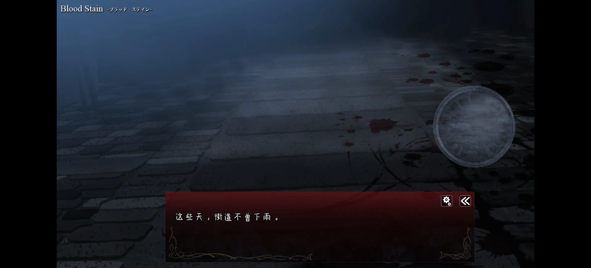
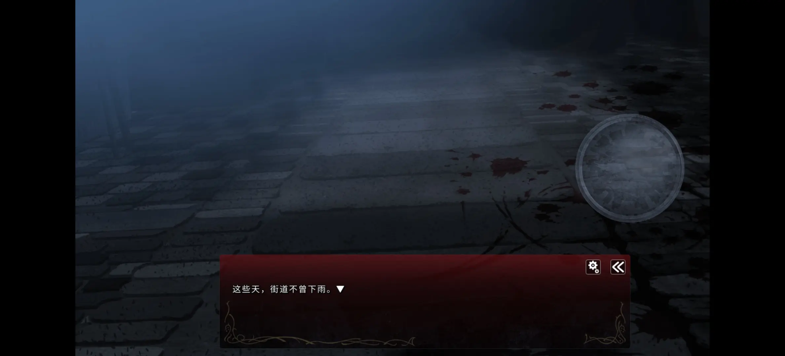
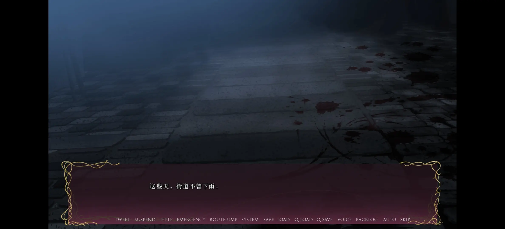
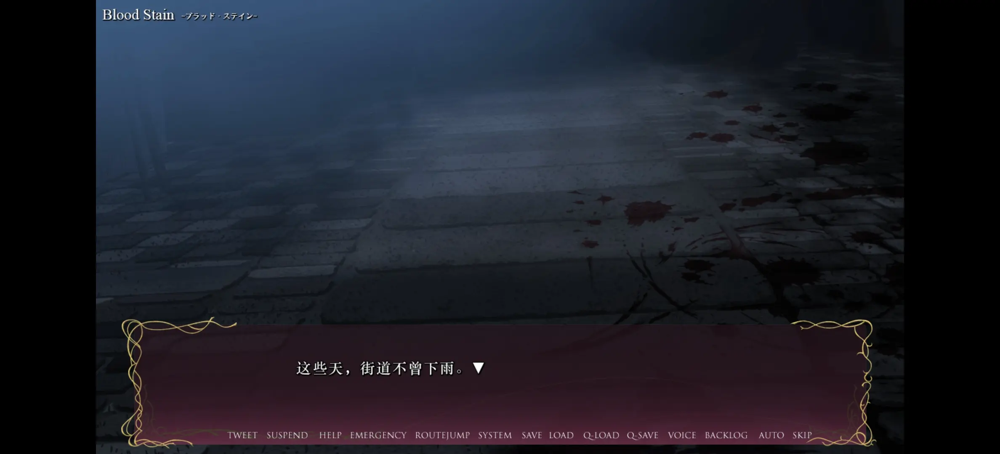

<details>
<summary>目录</summary>

- [更换字体](#更换字体)
- [放大字体](#放大字体)
    - [方法一](#方法一)
    - [方法二](#方法二)
- [同步存档](#同步存档)

</details>

我平时既会用电脑玩，也会用手机玩，用 Git 维护存档并通过 GitHub 同步，因此需要双端存档兼容，一般下载 PC 版，手机使用 Winlator 游玩。

奈何脏翅膀比较麻烦，找到的汉化硬盘版在手机的 Winlator 怎么也打不开，有进程无窗口，尝试了很多参数组合也没有成功。咨询群友后决定转向 PC + TY ([Tyranor](https://t.me/Tyranor/)) 版本（虽然汉化硬盘版的汉化质量明显更高）。

> 貌似只有[这里](https://inarigal.com/detail/533)有不限速盘的 PC + TY 资源（`秽翼的尤斯蒂娅 Tyranor 下载`）。
>
> <details>
> <summary>SHA256</summary>
>
> - `秽翼的尤斯蒂娅.rar`: `f3088118c89218cdb19eac73a9df97ae0837386606ac1e866e27fcb2e6b8a503`
>
> </details>

## 更换字体

自带的两种字体又小又不好看。




群友提到如果字体太小可以自己拆包更换字体，于是使用 [GARbro](https://github.com/morkt/garbro) 尝试拆包，发现字体在 `root.pfs.000` 内，路径为 `image/font/`，有三个文件，分别是
- `sourcehansans-bold.otf`
- `sourcehansans-medium.otf`
- `v3.ttf`

`.otf` 不熟悉，但 `.ttf` 我比较熟悉，我在 Galgame 常用的字体是华文中宋，电脑内的华文中宋是 `STZHONGS.TTF`，也是 `.ttf` 格式，因此可以直接替换。

问题是应该如何替换，GARbro 并未提供封包功能。

这时我想起群友提到过 PC + TY 版本的引擎是 [Artemis](https://www.ies-net.com/)，于是搜索 `Artemis 引擎 封包`，搜到了很多文章，其中[这一篇文章](https://www.bilibili.com/opus/568495301662731170)提到，Artemis 引擎支持免封包读取，只要路径相同即可，且游戏目录下的文件则比封包内的文件优先级更高。

这样一来就非常容易了，将 `STZHONGS.TTF` 重命名成 `v3.ttf`，然后放置在游戏目录内的 `image/font/` 下（需要自行创建目录），重启游戏，果然成功，在游戏内对应“明朝”字体。



## 放大字体

正如群友所言，这个字体太小，需要放大。

> 解决问题请优先参考[方法二](#方法二)。

### 方法一

我马上想到让 AI 写代码放大字体。

<details>
<summary>代码</summary>

```python
from fontTools.ttLib import TTFont
from fontTools.pens.transformPen import TransformPen
from fontTools.pens.ttGlyphPen import TTGlyphPen

# 打开字体
font = TTFont("v3.ttf")
scale_factor = 1.25  # 放大比例为 125%

glyph_set = font.getGlyphSet()
hmtx = font['hmtx']

# 修改字形与字宽
for name in font.getGlyphOrder():
    glyph = font['glyf'][name]
    if glyph.isComposite():
        continue
    
    # 修改横向 Advance Width
    width, lsb = hmtx[name]
    hmtx[name] = (int(width * scale_factor), int(lsb * scale_factor))

    # 缩放坐标
    pen = TTGlyphPen(glyph_set)
    tpen = TransformPen(pen, (scale_factor, 0, 0, scale_factor, 0, 0))
    glyph.draw(tpen, font['glyf'])
    font['glyf'][name] = pen.glyph()

# 保存字体
font.save("output.ttf")
```

</details>

用输出的字体替换，游戏内字体大小变得十分舒适。



### 方法二

后来我无意中又打开了刚才参考的文章，发现我之前阅读进度的下一节就是 `#0x6 字体修改`，里面不仅提到了替换字体，还提到了更改字体大小，方法是把 `system` 文件夹拆出来，全局搜索字体名称，找到定义字体大小的常量，修改，再将相关文件放到相同目录。

我立刻开始尝试，`system` 文件夹位于 `root.pfs`。不过在拆出来的 `system` 全局搜索 `v3.ttf` 并未搜到与字体大小有关的内容，只有一个 `get_font_face()` 函数。

尝试搜索 `size`，有 131 个结果，发现前几个结果是下划线命名法，于是再搜索 `font_size`，终于在 `system/system/var.lua` 内发现了目标：

```lua
font_size = {
	MIN   = 8,
	SMALL = 16,
	NORM  = 25,
	LARGE = 36,
	HUGE  = 46,
}
```

方法一的代码是放大到原来的 1.25 倍，于是我将每个大小也如此修改并向下取整：

```lua
font_size = {
	MIN   = 10,
	SMALL = 20,
	NORM  = 31,
	LARGE = 45,
	HUGE  = 57,
}
```

将该文件放置在游戏目录下的 `system/system/var.lua`，再把 `v3.ttf` 替换成未放大的华文中宋，启动游戏，效果与方法一一模一样。

理论上方法二是更优的，因为若游戏排版文字（比如行高和换行）时使用了 `font_size`，方法一可能会导致排版错乱，而方法二概率更小；当然，如果其他使用 Artemis 的作品在二进制文件中硬编码了字号，那就只能使用方法一了。

## 同步存档

能玩之后，自然要考虑同步存档，依然使用 Git 和 GitHub，但这次有些特殊，因为 Tyranor 的存档目录是游戏根目录，而 PC 的存档目录是游戏根目录下的 `savedata/`，于是需要使用 `.gitignore` 排除无关文件，加上自己创建的 `image/` 和 `system/` 目录，总共只需要忽略 6 项，非常少。

手机推送，电脑拉取，成功同步，然而电脑推送，手机拉取后，Tyranor 无法进入游戏（闪退），猜测是由于 `system.dat` 指定了桌面模式，而 Tyranor 无法使用桌面模式，所以闪退。于是在 `.gitignore` 添加 `system.dat`，顺便加上可能造成类似问题的 `system.ini`。

再测试，双端成功相互同步。

<details>
<summary>可用的 <code>.gitignore</code></summary>

```
image/
movie/
system/
Eustia_test.exe
root.pfs
root.pfs.000
system.dat
system.ini
```
