<details>
<summary>目录</summary>

- [更换字体](#更换字体)
- [放大字体](#放大字体)
    - [方法一](#方法一)
    - [方法二](#方法二)
    - [对比](#对比)
- [同步存档](#同步存档)
- [汉化问题](#汉化问题)
    - [整合汉化](#整合汉化)
    - [翻译缺失与错别字](#翻译缺失与错别字)
- [彻底解决排版问题](#彻底解决排版问题)
    - [历史记录](#历史记录)
    - [换行](#换行)
- [修复 OP 及其他视频](#修复-op-及其他视频)
- [其他](#其他)
    - [其他字体大小](#其他字体大小)
    - [关于存档文件](#关于存档文件)
    - [关于 pfs-tool](#关于-pfs-tool)
- [环境与工具版本](#环境与工具版本)
    - [环境](#环境)
    - [工具版本](#工具版本)
- [讨论](#讨论)

</details>

我平时既会用电脑玩，也会用手机玩，用 Git 维护存档并通过 GitHub 同步，因此需要双端存档兼容，一般下载 PC 版，手机使用 [Winlator](https://github.com/brunodev85/winlator) 游玩。

奈何脏翅膀比较麻烦，找到的汉化硬盘版在手机的 Winlator 怎么也打不开，有进程无窗口，尝试了很多参数组合也没有成功。咨询群友后决定转向 PC + TY ([Tyranor](https://t.me/Tyranor/)) 版本。

初步对比两个版本：
- PC + TY 版的 UI 更先进
- 二者的汉化文本完全相同，均为枫笛汉化组
- 汉化硬盘版的图片有翻译，PC + TY 版没有，比如开篇第一句话
    - 汉化硬盘版：
    - PC + TY 版：

虽然很想玩更精致的汉化，但也只能舍弃了。

## 更换字体

自带的两种字体又小又不好看。


群友提到如果字体太小可以自己拆包更换字体，于是使用 [GARbro](https://github.com/morkt/garbro) 尝试拆包，发现字体在 `root.pfs.000` 内，路径为 `image/font/`，有三个文件，分别是
- `sourcehansans-bold.otf`
- `sourcehansans-medium.otf`
- `v3.ttf`

`.otf` 不熟悉，但 `.ttf` 我比较熟悉，我在 Galgame 常用的字体是华文中宋，电脑内的华文中宋是 `STZHONGS.TTF`，也是 `.ttf` 格式，因此可以直接替换。

问题是应该如何替换，GARbro 并未提供封包功能。

这时我想起群友提到过 PC + TY 版本的引擎是 [Artemis](https://www.ies-net.com/)（特征为资源文件扩展名是 `.pfs`），于是搜索 `Artemis 引擎 封包`，搜到了很多文章，其中[这一篇文章](https://www.bilibili.com/opus/568495301662731170)提到，Artemis 引擎支持免封包读取，只要路径相同即可，且游戏目录下的文件则比封包内的文件优先级更高。

这样一来就非常容易了，将 `STZHONGS.TTF` 重命名成 `v3.ttf`，然后放置在游戏目录内的 `image/font/` 下（需要自行创建目录），重启游戏，果然成功，在游戏内对应“明朝”字体。


## 放大字体

正如群友所言，这个字体太小，需要放大。

### 方法一

我马上想到让 AI 写代码放大字体。

<details>
<summary>代码</summary>

```python
import sys
from fontTools.ttLib import TTFont
from fontTools.pens.transformPen import TransformPen
from fontTools.pens.ttGlyphPen import TTGlyphPen

input_path = "input.ttf"
output_path = "output_scaled.ttf"
scale_factor = 1.25  # 放大比例 125%

print(f"正在加载字体文件: {input_path}")
font = TTFont(input_path)

glyph_order = font.getGlyphOrder()
total_glyphs = len(glyph_order)

glyph_set = font.getGlyphSet()
hmtx = font['hmtx']
glyf = font['glyf']

new_glyfs = {}

# 设置进度打印间隔：每完成 5% 的进度打印一次
print_interval = max(1, total_glyphs // 20)

print(f"开始处理字形，总计 {total_glyphs} 个...")

for idx, name in enumerate(glyph_order, start=1):
    # 1. 缩放字符宽度与左边距
    width, lsb = hmtx[name]
    hmtx[name] = (int(round(width * scale_factor)), int(round(lsb * scale_factor)))

    glyph = glyf[name]
    if glyph.numberOfContours == 0 and not glyph.isComposite():
        pass
    else:
        # 2. 绘制并缩放字形（自动展开复合字形）
        pen = TTGlyphPen(glyph_set)
        tpen = TransformPen(pen, (scale_factor, 0, 0, scale_factor, 0, 0))
        glyph_set[name].draw(tpen)
        new_glyfs[name] = pen.glyph()

    # 3. 按百分比间隔输出进度，避免频繁 I/O
    if idx % print_interval == 0 or idx == total_glyphs:
        percent = (idx / total_glyphs) * 100
        print(f"处理进度: {idx}/{total_glyphs} ({percent:.1f}%)")

print("正在更新字形表数据...")
for name, new_glyph in new_glyfs.items():
    glyf[name] = new_glyph

print(f"正在保存文件至: {output_path}")
font.save(output_path)
print("字体处理完成。")
```

</details>

用输出的字体替换，游戏内字体大小变得十分舒适。


### 方法二

后来我无意中又打开了刚才参考的文章，发现之前阅读进度的下一节就是 `#0x6 字体修改`，里面不仅提到了替换字体，还提到了更改字体大小，方法是把 `system` 文件夹拆出来，全局搜索字体名称，找到定义字体大小的常量，修改，再将相关文件放到相同目录。

我立刻开始尝试，`system` 文件夹位于 `root.pfs`。不过在拆出来的 `system` 全局搜索 `v3.ttf` 并未搜到与字体大小有关的内容，只有一个 `get_font_face()` 函数。

尝试搜索 `size`，有 131 个结果，发现前几个结果是下划线命名法，于是再搜索 `font_size`，终于在 `system/system/var.lua` 内发现了目标：

```lua
font_size = {
	MIN   = 8,
	SMALL = 16,
	NORM  = 25,
	LARGE = 36,
	HUGE  = 46,
}
```

方法一的代码是放大到原来的 1.25 倍，于是我将每个大小也如此修改并向下取整：

```lua
font_size = {
	MIN   = 10,
	SMALL = 20,
	NORM  = 31,
	LARGE = 45,
	HUGE  = 57,
}
```

将该文件放置在游戏目录下的 `system/system/var.lua`，再把 `v3.ttf` 替换成未放大的华文中宋，启动游戏，效果与方法一一模一样。

### 对比

理论上方法二是更优的，因为若游戏排版文字（比如换行和行间距）时使用 `font_size` 而忽略显示文字的实际大小，方法一可能会导致排版错乱，而方法二概率更小。

然而脏翅膀正好是个例外，虽然两种方法对于短文本的效果一模一样（如方法一的图），但对于长文本或多行文本，方法一的效果反而更好。

比如下面这句话
- 未处理
    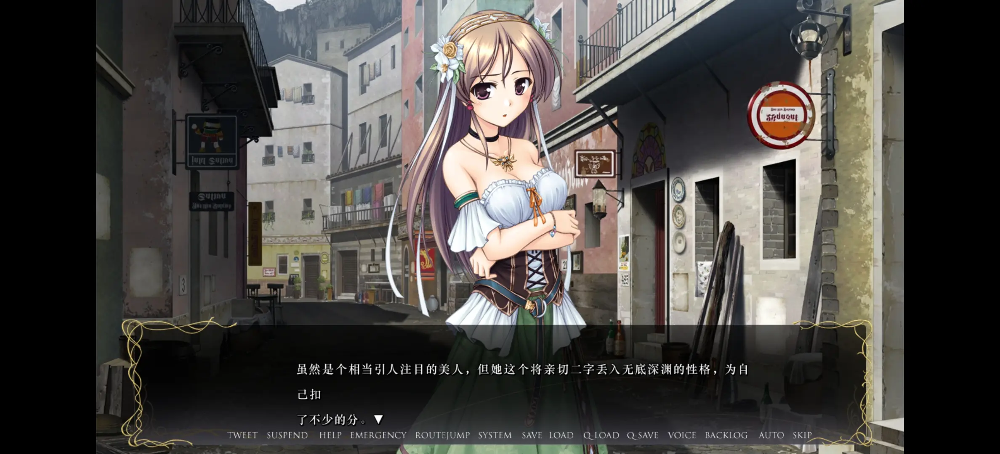
- 方法一
    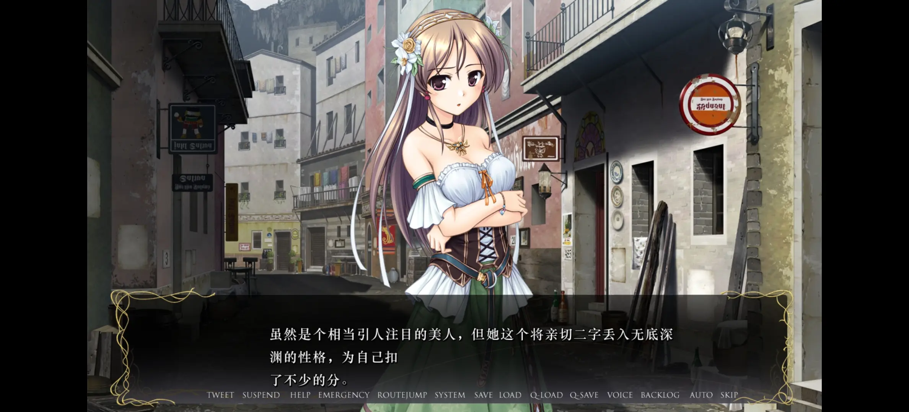
- 方法二
    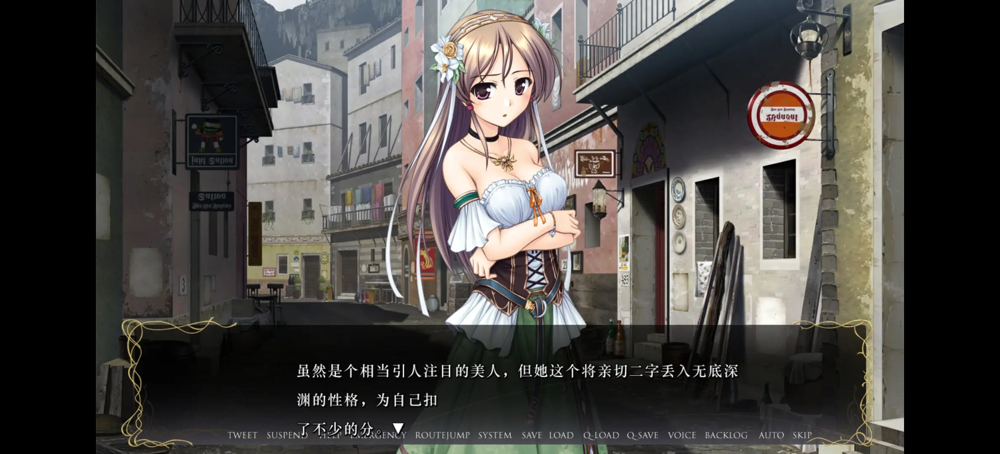

首先是换行，三种情况文本换行的绝对位置相同，未处理的第一行有 35 个字，方法一和方法二的第一行都是 28 个字，可以看出，游戏内处理换行时使用的是单个文字的实际宽度，因此方法一不会造成换行问题。

其次是行间距。

| | `font_size` | 字体文件字体大小 | 实际字体大小 | 实际行间距 |
|-|-|-|-|-|
| 未处理 | 较小 | 较小 | 过小 | 过大 |
| 方法一 | 较小 | 较大 | 适中 | 适中 |
| 方法二 | 较大 | 较小 | 适中 | 过大 |

另外在 `system` 全局搜索 `gap`、`height`、`spacing` 并未找到行间距相关常量。

综上，可以认为行间距被硬编码在二进制文件中，与 `font_size` 无关，每行文本的纵坐标由这个数和 `font_size` 决定，但与字体文件的字体大小无关。

基于此结论，理论上方法一有可能导致相邻行的文字重叠，而方法二是最优的解法。然而，从实际效果来看，游戏硬编码的行间距过大（未处理的行间距约等于文字高度），且该行间距适配未处理的小字号，使得文字不会与其他 UI 重叠；换成更大的 `font_size` 后，每行的高度增大，行间距不变，导致三行文本的总高度过大，最后一行文本与底部 UI 重叠。

而方法一属于歪打正着，由于 `font_size` 没变，游戏认为每行高度也没变，因此每一行的纵坐标与未处理相同（三行文本的总高度与未处理基本相同，也印证了这一点），而硬编码的过大行间距使得相邻行的文字还不够重叠，反而更大的实际字体大小抵消了过大的行间距，使得实际行间距十分舒适。

## 同步存档

能玩之后，自然要考虑同步存档，依然使用 Git 和 GitHub，但这次有些特殊，因为 Tyranor 的存档目录是游戏根目录，而 PC 的存档目录是游戏根目录下的 `savedata/`，于是需要使用 `.gitignore` 排除无关文件，加上自己创建的 `image/` 和 `system/` 目录，总共只需要忽略 6 项，非常少。

手机推送，电脑拉取，成功同步，然而电脑推送，手机拉取后，Tyranor 无法进入游戏（闪退），猜测是由于 `system.dat` 指定了桌面模式，而 Tyranor 无法使用桌面模式，所以闪退。于是在 `.gitignore` 添加 `system.dat`，顺便加上可能造成类似问题的 `system.ini`。

再测试，双端成功相互同步。

<details>
<summary>可用的 <code>.gitignore</code></summary>

```
image/
movie/
system/
Eustia_test.exe
root.pfs
root.pfs.000
system.dat
system.ini
```

</details>

后来发现 Tyranor 实际可以在设置中改为桌面模式，此前猜想错误，目前原因未知，但忽略 `system.dat` 和 `system.ini` 确实可以解决问题。

## 汉化问题

### 整合汉化

我一开始下载到的汉化硬盘版应该是 2011 年的[《穢翼のユースティア 初回版》](https://vndb.org/r7224)，引擎是 BGI/Ethornell（可执行文件是 `BGI.exe`，资源文件扩展名是 `.arc`），为什么同一个游戏会有两套引擎的版本呢？调查发现，八月社在 2016 年发布了[《穢翼のユースティア～新装版～》](https://vndb.org/r49044)，支持 Windows 和 Android，引擎换成了 Artemis，这就是我手上的 PC + TY 版。

既然都出自官方之手，可以猜测为了方便，迁移引擎的时候大多数资源文件的文件名都不会有变化，再结合 Artemis 优秀的文件读取机制，我突然想到，有没有可能把汉化硬盘版汉化的图片搬到 PC + TY 版？

从游戏开头的几句图片文本入手，先在 PC + TY 版寻找，发现在 `root.pfs.000` 内，位于 `image/obj/dic/`，12 句话分别是 `aiy00010_01.png` 到 `aiy00010_12.png`。再在汉化硬盘版寻找，果不其然，在 `data02800.arc` 内找到了图片 `aiy00010_01` 到 `aiy00010_12`，正是游戏开头汉化过的图片。

进一步对比，`root.pfs.000/image/obj/dic/` 内有 608 个文件，`data02800.arc` 内有 593 个文件，大量文件的文件名相同，可以认为就是相同作用的文件夹，另外对比了两个版本开头图片的尺寸，发现一模一样，于是用 GARbro 把 `data02800.arc` 内的所有图片提取成 PNG，并放置在 PC + TY 版游戏目录的 `image/obj/dic/` 下，启动 PC + TY 版，点击 START。


成功了。

> 新装版多出来的 15 个文件怎么办？Artemis 在 `image/obj/dic/` 读取不到会自动继续在 `root.pfs.000` 寻找，所以不会发生错误。

### 翻译缺失与错别字

游玩过程中，发现不少人名没有翻译，也发现了一些错别字，在此整理出。

<details>
<summary>点击展开</summary>

```yaml
all:
  - original: "'0': 不蝕金鎖の男\n"
    correct: "'0': 不蚀金锁的男人\n"
  - original: "'0': 聖女\n"
    correct: "'0': 圣女\n"
  - original: "'0': 女性の声\n"
    correct: "'0': 女性的声音\n"
  - original: "'0': 派手な女見物客\n"
    correct: "'0': 打扮花哨的女看客\n"
  - original: "'0': 中年の見物客\n"
    correct: "'0': 中年的看客\n"
  - original: "'0': 柄の悪い見物客\n"
    correct: "'0': 语气恶劣的看客\n"
  - original: "'0': ゴツい見物客\n"
    correct: "'0': 身材魁梧的看客\n"
  - original: "'0': 付き人\n"
    correct: "'0': 侍从\n"
  - original: "'0': 男\n"
    correct: "'0': 男子\n"
  - original: "'0': 羽つきの少年\n"
    correct: "'0': 长着翅膀的少年\n"
  - original: "'0': 羽狩りの指揮者\n"
    correct: "'0': 羽狩的指挥者\n"
  - original: "'0': 赤毛の羽狩り\n"
    correct: "'0': 红发的羽狩\n"
  - original: "'0': 羽狩りの副隊長\n"
    correct: "'0': 羽狩的副队长\n"
  - original: "'0': ラング副隊長\n"
    correct: "'0': 兰格副队长\n"
  - original: "'0': 坊主の男\n"
    correct: "'0': 光头男子\n"
  - original: "'0': カイム＆ジーク\n"
    correct: "'0': 凯伊姆＆吉克\n"
  - original: "'0': 女\n"
    correct: "'0': 女子\n"
  - original: "'0': ヒゲの酔客\n"
    correct: "'0': 胡子拉碴的醉汉\n"
  - original: "'0': 太鼓腹の酔客\n"
    correct: "'0': 大肚子的醉客\n"
  - original: "'0': 少女の声\n"
    correct: "'0': 少女的声音\n"
  - original: "'0': 薄汚れた男\n"
    correct: "'0': 邋遢的男子\n"
  - original: "'0': 太った男\n"
    correct: "'0': 肥胖的男子\n"
  - original: "'0': 女の主\n"
    correct: "'0': 女主人\n"
  - original: "'0': ただのジーク\n"
    correct: "'0': 普通的吉克\n"
  - original: "'0': 痩せた羽狩り\n"
    correct: "'0': 瘦削的羽狩\n"
  - original: "'0': 高い男の声\n"
    correct: "'0': 尖细的男声\n"
  - original: "'0': 太い男の声\n"
    correct: "'0': 粗沉的男声\n"
  - original: "'0': 鷲鼻の羽狩り\n"
    correct: "'0': 鹰钩鼻的羽狩\n"
  - original: "'0': フィオネ隊長\n"
    correct: "'0': 菲奥奈队长\n"
  - original: "'0': 娼館主\n"
    correct: "'0': 娼馆老板\n"
  - original: "'0': 羽が折れた少女\n"
    correct: "'0': 折翼的少女\n"
  - original: "'0': 隻腕の少女\n"
    correct: "'0': 独臂少女\n"
  - original: "'0': 男の声\n"
    correct: "'0': 男性的声音\n"
  - original: "'0': 中年の乞食\n"
    correct: "'0': 中年乞丐\n"
  - original: "'0': 覆面の男\n"
    correct: "'0': 蒙面男子\n"
  - original: "'0': 鼻血を流している男\n"
    correct: "'0': 流着鼻血的男子\n"
  - original: "'0': 太った羽狩り\n"
    correct: "'0': 肥胖的羽狩\n"
  - original: "'0': 猫背の男\n"
    correct: "'0': 驼背的男子\n"
  - original: "'0': 太った女\n"
    correct: "'0': 肥胖的女子\n"
  - original: "'0': 神経質そうな女\n"
    correct: "'0': 神经质的女子\n"
  - original: "'0': 薄汚いガキ\n"
    correct: "'0': 邋遢的小鬼\n"
  - original: "'0': 痩せた老婆\n"
    correct: "'0': 干瘪的老太婆\n"
  - original: "'0': 女の声\n"
    correct: "'0': 女性的声音\n"
  - original: "'0': 中年の野次馬\n"
    correct: "'0': 中年看客\n"
  - original: "'0': ゴツい野次馬\n"
    correct: "'0': 魁梧的看客\n"
  - original: "'0': 黒羽\n"
    correct: "'0': 黑羽\n"
  - original: "'0': 不蝕金鎖の若い男\n"
    correct: "'0': 不蚀金锁的年轻男子\n"
  - original: "'0': 羽狩りたち\n"
    correct: "'0': 羽狩们\n"
  - original: "'0': 不蝕金鎖の幹部たち\n"
    correct: "'0': 不蚀金锁的干部们\n"
  - original: "'0': クーガー\n"
    correct: "'0': 库格尔\n"
  - original: "'0': 若い羽狩り\n"
    correct: "'0': 年轻的羽狩\n"
  - original: "'0': 常連の男\n"
    correct: "'0': 熟客男子\n"
  - original: "'0': 唇の薄い男\n"
    correct: "'0': 薄唇男子\n"
  - original: "'0': 鯰顔の売人\n"
    correct: "'0': 鲶鱼脸的贩子\n"
  - original: "'0': アイム\n"
    correct: "'0': 阿伊姆\n"
  - original: "'0': 短髪の男\n"
    correct: "'0': 短发男子\n"
  - original: "'0': 片目の男\n"
    correct: "'0': 独眼男子\n"
  - original: "'0': ヒゲの男\n"
    correct: "'0': 留胡子的男子\n"
  - original: "'0': 眉のない男\n"
    correct: "'0': 无眉男子\n"
  - original: "'0': 顎の出た男\n"
    correct: "'0': 凸下巴的男子\n"
  - original: "'0': 精悍な男\n"
    correct: "'0': 精悍的男子\n"
  - original: "'0': 薄汚れた少女\n"
    correct: "'0': 邋遢的少女\n"
  - original: "'0': やつれた少女\n"
    correct: "'0': 憔悴的少女\n"
  - original: "'0': 謎の主\n"
    correct: "'0': 神秘的主人\n"
  - original: "'0': 酒場の客\n"
    correct: "'0': 酒馆的客人\n"
  - original: "'0': 酔っぱらいの男\n"
    correct: "'0': 醉汉男子\n"
  - original: "'0': 聖職者\n"
    correct: "'0': 圣职者\n"
  - original: "'0': 聖職者たち\n"
    correct: "'0': 圣职者们\n"
  - original: "'0': 集まった住民\n"
    correct: "'0': 聚集的居民\n"
  - original: "'0': 背の低い聖職者\n"
    correct: "'0': 身高矮小的圣职者\n"
  - original: "'0': 痩せぎすの聖職者\n"
    correct: "'0': 瘦骨嶙峋的圣职者\n"
  - original: "'0': 無愛想な店主\n"
    correct: "'0': 板着脸的店主\n"
  - original: "'0': 先代の聖女\n"
    correct: "'0': 前任圣女\n"
  - original: "'0': 住民\n"
    correct: "'0': 居民\n"
  - original: "'0': 虚ろな目の男\n"
    correct: "'0': 双眼空洞的男子\n"
  - original: "'0': 無精髭の男\n"
    correct: "'0': 留着胡茬的男子\n"
  - original: "'0': 牢獄の住民\n"
    correct: "'0': 牢狱居民\n"
  - original: "'0': 衛兵\n"
    correct: "'0': 卫兵\n"
  - original: "'0': 果物屋の客\n"
    correct: "'0': 水果店的客人\n"
  - original: "'0': 御者の男\n"
    correct: "'0': 马夫男子\n"
  - original: "'0': 近衛兵\n"
    correct: "'0': 近卫兵\n"
  - original: "'0': 鎧姿の男\n"
    correct: "'0': 身穿铠甲的男子\n"
  - original: "'0': リシア王女\n"
    correct: "'0': 莉西亚公主\n"
  - original: "'0': 召使い\n"
    correct: "'0': 仆人\n"
  - original: "'0': 料理長\n"
    correct: "'0': 厨师长\n"
  - original: "'0': 庭師の老人\n"
    correct: "'0': 园丁老人\n"
  - original: "'0': ネヴィル\n"
    correct: "'0': 奈菲尔\n"
  - original: "'0': 御者の親父\n"
    correct: "'0': 车夫老爹\n"
  - original: "'0': 露店の店主\n"
    correct: "'0': 摊贩老板\n"
  - original: "'0': 乞食の子供\n"
    correct: "'0': 乞丐小孩\n"
  - original: "'0': 坊主頭の羽狩り\n"
    correct: "'0': 光头的羽狩\n"
  - original: "'0': 中年の近衛兵\n"
    correct: "'0': 中年近卫兵\n"
  - original: "'0': 若い近衛兵\n"
    correct: "'0': 年轻的近卫兵\n"
  - original: "'0': 壮年の貴族\n"
    correct: "'0': 壮年贵族\n"
  - original: "'0': 研究員\n"
    correct: "'0': 研究员\n"
  - original: "'0': 若い貴族\n"
    correct: "'0': 年轻贵族\n"
  - original: "'0': 貴族\n"
    correct: "'0': 贵族\n"
  - original: "'0': 母親\n"
    correct: "'0': 母亲\n"
  - original: "'0': 仮面の人物\n"
    correct: "'0': 戴面具的人\n"
  - original: "'0': 主治医\n"
    correct: "'0': 主治医生\n"
  - original: "'0': ヴァリアスの妻\n"
    correct: "'0': 法利亚斯的妻子\n"
  - original: "'0': 大柄な男\n"
    correct: "'0': 身材高大的男子\n"
  - original: "'0': 痩せた男\n"
    correct: "'0': 消瘦的男子\n"
  - original: "'0': 筋肉質の男\n"
    correct: "'0': 健硕的男子\n"
  - original: "'0': でかい賊の男\n"
    correct: "'0': 魁梧的盗贼男子\n"
  - original: "'0': 賊の男\n"
    correct: "'0': 盗贼男子\n"
  - original: "'0': ネヴィル卿\n"
    correct: "'0': 奈菲尔卿\n"
  - original: "'0': 近衛騎士団\n"
    correct: "'0': 近卫骑士团\n"
  - original: "'0': 怪我をした男\n"
    correct: "'0': 受伤的男子\n"
  - original: "'0': 蓬髪の乞食\n"
    correct: "'0': 蓬头垢面的乞丐\n"
  - original: "'0': 隻眼の乞食\n"
    correct: "'0': 独眼乞丐\n"
  - original: "'0': 殺気だった男の声\n"
    correct: "'0': 充满杀气的男声\n"
  - original: "'0': 痩せた兵士\n"
    correct: "'0': 消瘦的士兵\n"
  - original: "'0': 苦しそうな男の声\n"
    correct: "'0': 痛苦的男声\n"
  - original: "'0': 痩せた研究員\n"
    correct: "'0': 消瘦的研究员\n"
  - original: "'0': 信心深い牢獄民\n"
    correct: "'0': 虔诚的牢狱民\n"
  - original: "'0': 怪我をした牢獄民\n"
    correct: "'0': 受伤的牢狱民\n"
  - original: "'0': 初代イレーヌ\n"
    correct: "'0': 初代伊莲\n"
  - original: "'0': 酔客\n"
    correct: "'0': 醉客\n"
  - original: "'0': 露天売り\n"
    correct: "'0': 露天摊贩\n"
  - original: "'0': 酒場の店主\n"
    correct: "'0': 酒馆店主\n"
  - original: "'0': 二人\n"
    correct: "'0': 两人\n"
  - original: "'0': 若手の庭師\n"
    correct: "'0': 年轻的园丁\n"
  - original: "'0': 酔っぱらい\n"
    correct: "'0': 醉汉\n"
  - original: "'0': ルキウス・システィナ\n"
    correct: "'0': 鲁基乌斯·西斯狄娜\n"
  - original: "'0': 吉巴鲁特\n"
    correct: "'0': 吉尔巴鲁特\n"
aiy20180:
  - original: 弯向不同方向的额１０根手指。
    correct: 弯向不同方向的１０根手指。
aiy20190:
  - original: 引导到正规上的过程中
    correct: 引导到正轨上的过程中
aiy20230:
  - original: 被子伸了过来
    correct: 杯子伸了过来
  - original: 背反
    correct: 背叛
  - original: 馬鹿
    correct: 笨蛋
aiy30230:
  - original: 爱慕者
    correct: 爱慕着
aiy40190:
  - original: 奈菲尔请
    correct: 奈菲尔卿
aiy40470:
  - original: 她要我
    correct: 他要我
aiy50060:
  - original: 在长大
    correct: 再长大
aiy50100:
  - original: 塞紧
    correct: 塞进
  - original: 把？
    correct: 吧？
aiy50110:
  - original: 不不再
    correct: 不再
aiy50220:
  - original: 不和我口味
    correct: 不合我口味
aiy70110:
  - original: 明天、后年
    correct: 明年、后年
aiy70120:
  - original: 在在意
    correct: 再在意
aiy70410:
  - original: 大概是把
    correct: 大概是吧
```

</details>

可将以上内容在 PC + TY 版游戏根目录下保存为 `correction.yaml`，然后运行“换行”一节的[参考批量处理代码](#参考批量处理代码)，即可生效。

## 彻底解决排版问题

### 历史记录

对比放大字体的两个方案之后，我选择了方法一，本来以为没事了，直到我在一处长文本打开历史记录：

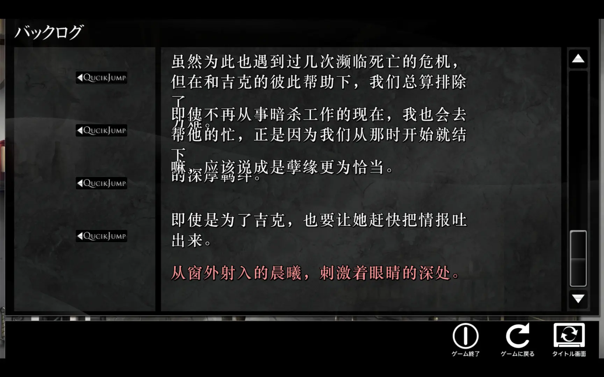

先换成未放大的华文中宋观察一下：

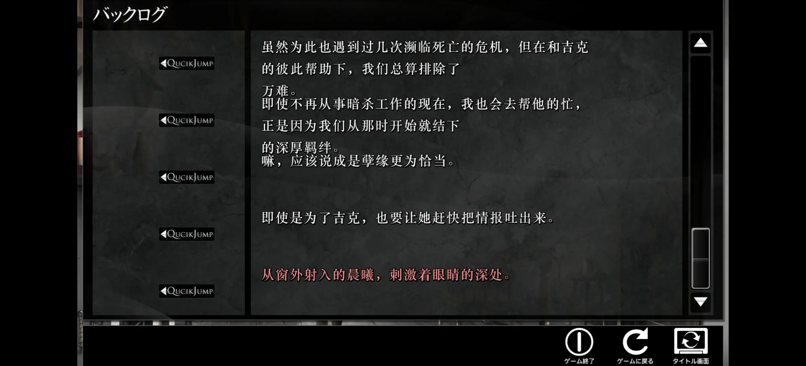

可以发现历史记录的文字排版逻辑与对话框完全相同。

但小字体对对话框来说太小了，所以必须使用大字体，于是自然想到调整 `font_type`，另外发现历史记录文本的字号明显比对话框的文本大，说明不是同一种大小，那么就可以只修改历史记录文本使用的大小，而不影响对话框文本。

每次把一个类别的字号改成 60，观察游戏内情况，以确定对应关系。结论是，对话框使用的是 `NORM`，而历史记录，哪个都不是。

难道硬编码了？其实不然，我在 `system` 文件夹全局搜索 `backlog`，在 `system/msg.iet`（其实是 Lua）发现了一段代码：

<details>
<summary>点击展开</summary>

```lua
function msg_backlog_init()
	local fontface = get_font_face()
	for i=1, 1 + init.backlog_page do
		-- 本文
		e:tag{"chgmsg", id=("500.100."..i..".0"), layered="0"}
		e:tag{"font",
			face		= fontface,
			left		= "360",
			top			= "68",
			width		= "660",
			height		= "540",
			size		= "30",
			rubyface	= fontface,
			rubysize	= "10",
			rubykerning	= "-4",
			spacetop    = "-4",
			spacemiddle = "-4",
			spacebottom = "0",
			color       = "0xFFFFFF",
			shadowcolor = "0x000000",
			outlinecolor= "0x000000",
			align       = "left",
			style       = "outline,shadow",
			kerning     = "-1",
			hung        = "0",
			stack		= "0" }
		init_adv_indent() -- インデント
		e:tag{"/chgmsg"}

		-- アクティブ文字色
		e:tag{"chgmsg", id=("500.100."..i..".10"), layered="0"}
		e:tag{"font",
			face		= fontface,
			left		= "360",
			top			= "68",
			width		= "660",
			height		= "540",
			size		= "30",
			rubyface	= fontface,
			rubysize	= "10",
			rubykerning	= "-4",
			spacetop    = "-4",
			spacemiddle = "-4",
			spacebottom = "0",
			color       = (init.backlog_color),
			shadowcolor = "0x000000",
			outlinecolor= "0x000000",
			align       = "left",
			style       = "outline,shadow",
			kerning     = "-1",
			hung        = "0",
			stack		= "0" }
		init_adv_indent() -- インデント
		e:tag{"/chgmsg"}

		-- 名前
		e:tag{"chgmsg", id=("500.100."..i..".1"), layered="0"}
		e:tag{"font",
			face         = fontface,
			left         = "60",
			top          = "72",
			width        = "640",
			height       = "160",
			size         = "35",
			rubyface     = fontface,
			rubysize     = "0",
			spacetop     = "0",
			spacemiddle  = "0",
			spacebottom  = "-8",
			color        = "0xFFFFFF",
			shadowcolor = "0x000000",
			outlinecolor= "0x000000",
			align        = "left",
			style        = "outline",
			kerning      = "0",
			hung         = "1",
			stack        = "0" }
		e:tag{"/chgmsg"}
	end
end
```

</details>

`本文` 对应历史记录的文本，`アクティブ文字色` 对应鼠标悬停的文本，`名前` 对应人名，可以三类文本看到使用的字号都是 35，比 `var.lua` 的 `NORM  = 25` 要大一些，与观察契合。实际上实验发现这里的 `size` 确实控制着历史记录文本的字号。

于是把三类文本的字号都改成 30（分别位于 `msg.iet` 的第 262、第 288 和第 364 行），果然不重叠了：

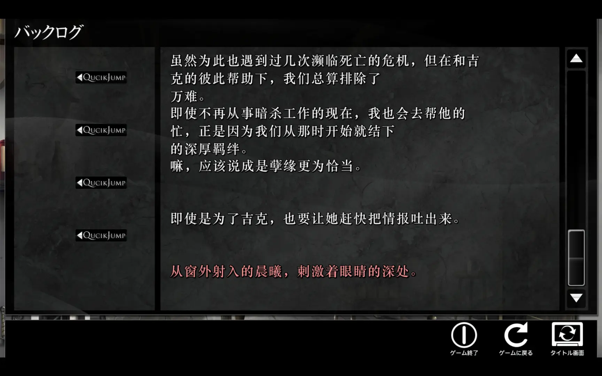

> 另外注意到 `msg.iet` 中的 `spacetop`、`spacemiddle` 和 `spacebottom`，我在 `system` 全局搜索发现不止出现在 `msg.iet`，有没有可能控制行间距？实验否定了这个猜想。

### 换行

回顾一下上文 `放大字体` → `方法一` 的效果图：


可以发现最后一个换行明显多余，当时我只当成是汉化组不小心多加了一个换行，然而继续游玩才发现这并非偶然，上文历史记录的长文本也可以看到明显多余的换行，这在常规对话框里也存在，比如上文历史记录的第一句：

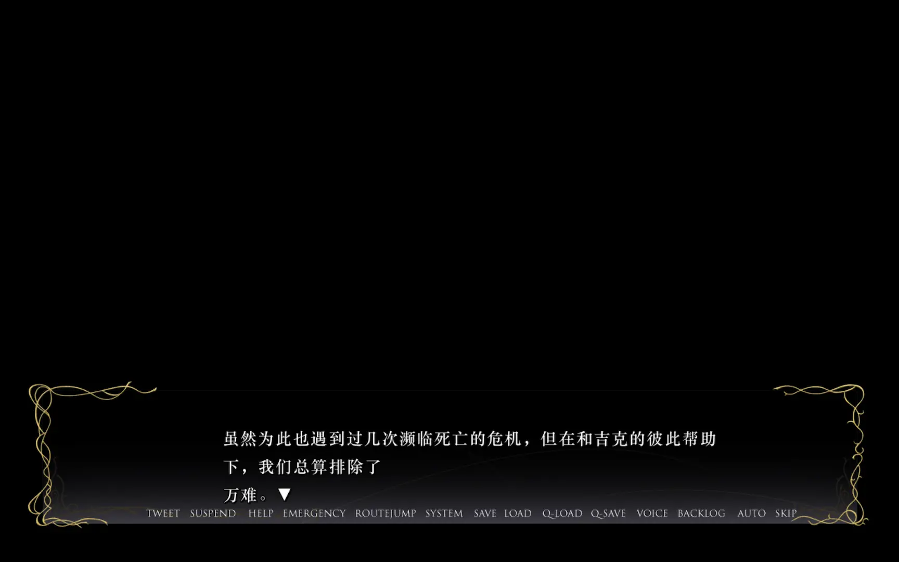

我猜测这个换行是使用原本字体时期望的换行位置，于是我在游戏内把字体换成“ゴシック”（Gothic），结果印证了我的想法：


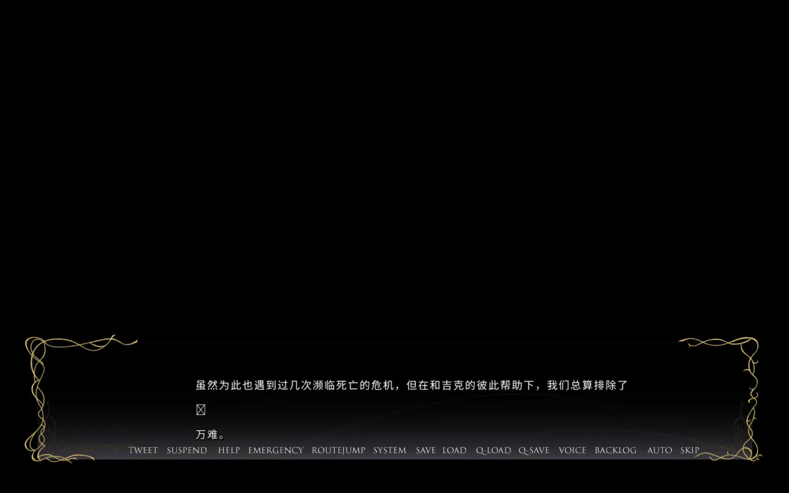

我在其他几处长文本也将字体换成 Gothic，发现都与上面两张图一样，在第 37 个字之后有一个换行符，无一例外。

也就是说，虽然文本绘制引擎支持自动换行，文本还是以 37 字为上限主动截断并添加换行符，意义不明，初回版也没有这个主动的换行符。

<details>
<summary>初回版效果</summary>


</details>

而使用大字号的华文中宋，就导致提前触发了一次自动换行，文本绘制引擎看到几个字之后的换行符，就再换了一次行，导致最终效果十分不美观。

修复这个问题必须直接修改台本文件，根据经验和直觉，找到了 `root.pfs/scenario/main/`，该目录下的 `aiy00010.asb` 到 `aiy81010.asb` 总共 404 个 `.asb` 文件大概率就是台本文件。

> [!NOTE]
>
> **太长不看**
>
> 使用 [msg-tool](https://github.com/lifegpc/msg-tool) 将 `.asb` 解析成 YAML：
>
> ```powershell
> .\msg_tool.exe export -t artemis-asb aiy00010.asb -T custom --custom-yaml true
> ```
>
> 同目录下输出的 `aiy00010.yaml` 就是解析后的台本文件，把 `\r\n` 全部删除。
> 
> 打包成 `.asb`：
>
> ```powershell
> .\msg_tool.exe create -t artemis-asb aiy00010.yaml --custom-yaml true
> ```
> 
> 同目录下输出的 `aiy00010.asb` 就是打包后的台本文件。
> 
> 对所有 `.asb` 这样操作，再放置在游戏目录下的 `scenario/main/` 即可。
>
> [参考批量处理代码](#参考批量处理代码)

GARbro 无法解析 `.asb`，于是搜索 `asb artemis engine`，搜到一个叫做 [artemis-engine-port-tools](https://github.com/ATSPwang618/artemis-engine-port-tools) 的项目，其中 [asb解密查看方法说明.zip](https://github.com/ATSPwang618/artemis-engine-port-tools/blob/main/asb%E8%A7%A3%E5%AF%86%E6%9F%A5%E7%9C%8B%E6%96%B9%E6%B3%95%E8%AF%B4%E6%98%8E.zip) 内有 `asbutil.exe`，使用以下命令即可解析 `.asb`：

```powershell
.\asbutil.exe aiy00010.asb > aiy00010.txt
```

查看内容，发现的确是台本，记录了每一句台词，以及画面信息，还发现长文本确实都在 37 字之后换到了下一行，证实了之前的想法，比如

```
[#0 print data="虽然是个相当引人注目的美人，但她这个将亲切二字丢入无底深渊的性格，为自己扣
了不少的分。"]
```

删除换行之后需要打包成 `.asb`，但 `asbutil.exe` 没有打包的功能，artemis-engine-port-tools 也没有收录相关工具，于是继续看刚才的搜索结果，找到了 Lib.rs 中的 [msg_tool_build](https://lib.rs/crates/msg_tool_build)，页面中提到 `Artemis Engine ASB file (.asb/.iet)`，顺藤摸瓜找到了 [GitHub 仓库](https://github.com/lifegpc/msg-tool)。

这个工具支持 Extract messages from script files、Import data into script files，以及 Create a new script file，其他功能都是操作归档，与台本无关。我先尝试使用第三个功能：

```powershell
.\msg-tool.exe create -t artemis-asb aiy00010.txt aiy00010.asb
```

结果报错 `Error creating file: expected value at line 1 column 1`。

README 中导入和创建的部分都只有一个标题和一行命令，没有任何解释，所以不知道创建功能需要什么，另外导入功能也不会用，导出功能只能导出 JSON 格式的台词，丢失了很多其他信息。

找不到其他工具，于是我点开了 Issues，发现已关闭的 Issues 居然有一个叫做 `添加对 《穢翼のユースティア 〜新装版〜》 asb格式的支持`（[#11](https://github.com/lifegpc/msg-tool/issues/11)），创建于三个月前，作者两天后回复脏翅膀的 `.asb` 与他之前测试游戏的 tag 结构不一样，并立刻添加支持、发布更新，提到 `-T custom --custom-yaml true` 可以强行提取成 YAML。

据此尝试

```powershell
.\msg_tool.exe export -t artemis-asb aiy00010.asb -T custom --custom-yaml true
```

确实可以，且 YAML 包含台本的所有信息，之前的换行变成了显式的 `\r\n`，比如

```yaml
- name: print
  line_number: 0
  attributes:
    data: "虽然是个相当引人注目的美人，但她这个将亲切二字丢入无底深渊的性格，为自己扣\r\n了不少的分。"
```

删除所有 `\r\n` 后再尝试创建

```powershell
.\msg-tool.exe create -t artemis-asb aiy00010.yaml aiy00010.asb
```

结果报错 `Error creating file: invalid number at line 1 column 2`，依然失败。

试错发现需要在 create 也加上 `--custom-yaml true`，即

```powershell
.\msg-tool.exe create -t artemis-asb aiy00010.yaml aiy00010.asb --custom-yaml true
```

将输出的 `aiy00010.asb` 放置在游戏目录下的 `scenario/main/`，启动游戏，多余换行不复存在。


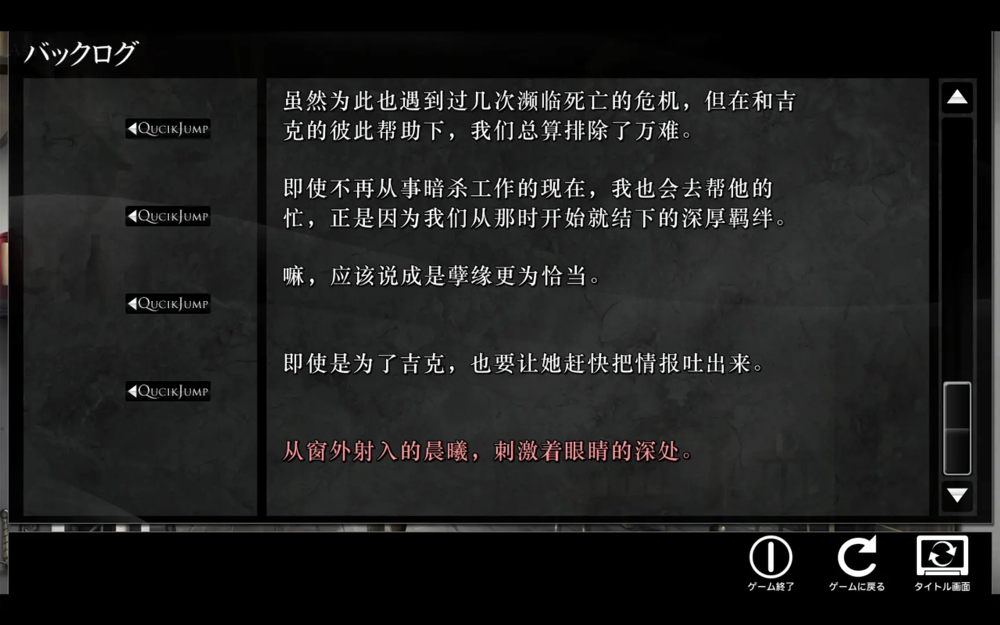

最后，编写程序批量转换所有 `.asb`，放置在游戏目录下的 `scenario/main/`，`.gitignore` 增加 `scenario/`，便彻底解决。

> [!NOTE]
> 
> **为什么选择直接删除所有 `\r\n`？**
>
> YAML 中台词对应的键是 `data`，即 `data: 文本`，尝试过以“前 35 到 45 个字符的切片包含 `data:`”作为删除 `\r\n` 的条件，结果是，输出的 YAML 还含有两处 `\r\n`，分别是 `aiy50010` 中的
>
> ```yaml
> data: "虽然说起来很伤悲，但这是为了维持诺瓦斯·艾蒂尔的稳定而必要的存在；去救下圣女，\r\n则会违反全体的利益。"
> ```
>
> `\r\n` 之前有 39 个字；以及 `aiy50030` 中的
> 
> ```yaml
> data: "即使每天被吸收着力量，也从未憎恨过\r\n人类。"
> ```
>
> `\r\n` 之前有 17 个字。显然，这两处 `\r\n` 也是多余的，而被删除的 `\r\n` 都满足“前 35 到 45 个字符的切片包含 `data:`”的条件，也就是说不会误删不该删除的 `\r\n`（除非刚好在第 37 字符左右需要分段，但这概率很小，也很难筛出），因此直接删除所有 `\r\n` 就是最优解。

#### 参考批量处理代码

1. 使用 [pfs-tool](https://github.com/788009/pfs-tool) 提取 `.asb` 台本文件到 `root/scenario/main/`。
2. 使用 msg_tool 将 `.asb` 转换成 `.yaml`。
    > 对于每个文件都应当输出
    > ```
    > Exporting root\scenario\main\aiyxxxxx.asb
    > OK: 1, Ignored: 0, Error: 0, Warning: 0
    > ```
3. 删除所有 `\r\n`。
4. 若游戏根目录存在[翻译缺失与错别字](#翻译缺失与错别字)一节提到的 `correction.yaml`，则执行替换。
5. 使用 msg_tool 将 `.yaml` 转换成 `.asb`，并移动到 `scenario/main/`。
    > 对于每个文件都应当输出
    > ```
    > OK: 0, Ignored: 0, Error: 0, Warning: 0
    > ```
    > 注意这里虽然输出 `OK: 0`，但实际会生成可用的 `.asb`，日志与实际情况不符的原因不明。
6. 若原本不存在 `root/`，则删除 `root/`。

确保 PC + TY 版游戏根目录下已放置 `pfs-tool.exe` 和 `msg_tool.exe`，然后在该目录运行以下 Python 代码。

<details>
<summary>点击展开</summary>

```python
import os
import re
import shutil
import subprocess
import yaml
from pathlib import Path

def main():
    pfs_tool = Path("pfs-tool.exe")
    msg_tool = Path("msg_tool.exe")
    pfs_file = Path("root.pfs")
    correction_file = Path("correction.yaml")

    root_dir = Path("root")
    extracted_scenario_dir = Path("root/scenario/main")
    target_scenario_dir = Path("scenario/main")

    # 记录执行前 root 目录是否存在
    root_existed_originally = root_dir.exists()

    # 步骤 1：使用 pfs-tool.exe 提取 root.pfs 中的 scenario/main
    cmd_unpack = [
        str(pfs_tool),
        "unpack",
        str(pfs_file),
        "scenario/main"
    ]
    subprocess.run(cmd_unpack, check=True)

    if not extracted_scenario_dir.exists():
        raise FileNotFoundError(f"未找到解包目录: {extracted_scenario_dir}")

    # 步骤 2：使用 msg_tool 将 root/scenario/main/ 下的 .asb 转换为 .yaml
    for asb_file in extracted_scenario_dir.glob("*.asb"):
        cmd_export = [
            str(msg_tool),
            "export",
            "-t", "artemis-asb",
            str(asb_file),
            "-T", "custom",
            "--custom-yaml", "true"
        ]
        subprocess.run(cmd_export, check=True)

    # 步骤 3：读取 root/scenario/main/ 下的 .yaml 文件，删除所有 \r\n 后原位覆盖写回
    for yaml_file in extracted_scenario_dir.glob("*.yaml"):
        text = yaml_file.read_text(encoding="utf-8")
        processed_text = text.replace("\r\n", "").replace(r"\r\n", "")
        yaml_file.write_text(processed_text, encoding="utf-8")

    # 步骤 4：若 correction.yaml 存在，读取并替换 .yaml 内容
    if correction_file.exists():
        with open(correction_file, "r", encoding="utf-8") as f:
            corrections = yaml.safe_load(f) or {}

        # 通用规则
        all_rules = corrections.get("all", [])

        for yaml_file in extracted_scenario_dir.glob("*.yaml"):
            file_stem = yaml_file.stem  # 例如 'aiy20190'
            specific_rules = corrections.get(file_stem, [])

            # 合并通用规则与特定文件的规则
            combined_rules = (all_rules if isinstance(all_rules, list) else []) + \
                             (specific_rules if isinstance(specific_rules, list) else [])

            if not combined_rules:
                continue

            text = yaml_file.read_text(encoding="utf-8")

            # 替换
            for item in combined_rules:
                if isinstance(item, dict):
                    orig = item.get("original")
                    corr = item.get("correct")
                    if orig is not None and corr is not None:
                        text = text.replace(str(orig), str(corr))

            yaml_file.write_text(text, encoding="utf-8")

    # 确保目标输出目录 scenario/main 存在
    target_scenario_dir.mkdir(parents=True, exist_ok=True)

    # 步骤 5：使用 msg_tool 将 .yaml 转换成 .asb，并将结果移动至 scenario/main
    for yaml_file in extracted_scenario_dir.glob("*.yaml"):
        cmd_create = [
            str(msg_tool),
            "create",
            "-t", "artemis-asb",
            str(yaml_file),
            "--custom-yaml", "true"
        ]
        subprocess.run(cmd_create, check=True)

        generated_asb = yaml_file.with_suffix(".asb")
        if generated_asb.exists():
            destination = target_scenario_dir / generated_asb.name
            shutil.move(str(generated_asb), str(destination))

    # 步骤 6：若运行前不存在 root 目录，则在清理时删除
    if not root_existed_originally and root_dir.exists():
        shutil.rmtree(root_dir)

if __name__ == "__main__":
    main()
```

</details>

> 试错时看到 Issue #11 的提出者最后说成功把旧版汉化移植到新版了，于是点进这个人的主页，意外发现有一个叫做 [asb_parser](https://github.com/kongbaiz/asb_parser) 的项目，标题是“ASB 解析/打包工具”，确实可以打包，但推进到每一个 `.asb` 结束时游戏都稳定崩溃，遂放弃。

## 修复 OP 及其他视频

> [!NOTE]
> 
> **太长不看**
>
> PC + TY 版有一个 `movie/` 文件夹，将其中的 MP4 都转换成固定码率的 MPG，放置在 `movie/`。
>
> 在 `movie/` 执行：
> 
> ```powershell
> Get-ChildItem -File | Where-Object { $_.Extension -match '\.(mp4|mkv|mov|avi)$' } | ForEach-Object { ffmpeg -i $_.FullName -c:v mpeg1video -b:v 7M -minrate 7M -maxrate 7M -bufsize 2400k -r 30 -pix_fmt yuv420p -c:a mp2 -b:a 192k -ar 44100 -f mpeg "$($_.BaseName).mpg" }
> ```

玩了两章都没看到 OP，遂在贴吧搜索，发现有两个帖子（[这个](https://tieba.baidu.com/p/9607922956)和[这个](https://tieba.baidu.com/p/9038382912)）都提到 TY 版无法播放 OP，而评论区提到的解决方案只有换 PC 版或在 B 站观看。

首先在初回版确认 OP 出现位置，确实在我目前进度之前，另外该 OP 无汉化。

PC + TY 版有一个 `movie/` 文件夹，其中的 `movie.mp4` 就是 OP；另外还有一个时长为 1:43 的 `aiy50010mov.mp4`，是比较后期才出现的视频。

商业游戏公司发布的作品不可能无法播放 OP，因此一定是汉化组或者后续分发过程的问题，也因此，这个问题一定可以修复，大不了找到新装版原版，把 OP 拆出来，再放置到我的游戏目录下。

Galgame 的视频一般不多，再考虑到不同引擎的视频解码能力也可能不同，官方在迁移引擎时完全有可能修改视频格式，甚至重命名视频文件，因此一开始虽然想到可以把初回版的 OP 拆出来放到 PC + TY 版，但没有立刻付诸尝试，认为应当先从 PC + TY 版本身寻找可以参考的信息。

考虑到 PC + TY 版可以播放 ED，若 ED 是视频，则可以找到 ED 的视频格式，并将 `movie.mp4` 也转换成该格式，然后放置在 ED 所在的目录。然而实际拆包发现，ED 不是视频，只有工作人员名单的图片，由程序播放音乐并控制图片流速，因此这条路走不通。

拆包时发现 `root.pfs` 有一个 `movie/` 文件夹，其中有 12 个 OGV 格式的视频，都是几秒钟的场景效果视频，看不出来用在哪里。

由此推测 PC + TY 版应当使用 OGV 格式的视频，于是将 `movie.mp4` 用 FFmpeg 转换成 `movie.ogv`，放置在 `movie/`，结果游戏内依然没有 OP。

走投无路，于是不抱希望地尝试直接移植初回版素材：在初回版的 `data02840.arc` 内有包括 `movie.mpg` 和 `aiy50010mov.mpg` 的 8 个 MPG 视频，是 PC + TY 版封包内外 12 + 2 共 14 个视频的子集。提取 `movie.mpg`，既然 PC + TY 版存放视频（虽然是 OGV）的文件夹是 `movie/`，我就将其放在 `movie/`，启动游戏——居然有 OP 了。

也就是说，游戏读取的文件是 `movie/movie.mpg`，但原因不明地，该文件缺失了，而为什么会特意放一个 `movie.mp4`，就是更奇怪的事情了。

至此，解决方案就是把初回版的 `movie.mpg` 和 `aiy50010mov.mpg` 拆出来，放置在游戏目录下的 `movie/` 文件夹，或者，如果没有初回版，也可以将 `movie/` 下的 2 个 MP4 转换成 MPG，再放置在游戏目录下的 `movie/` 文件夹。

转换参数十分重要，稍有不慎就会导致游戏内播放时出现崩坏和花屏的情况。我用 `ffprobe` 查看初回版 `movie.mpg` 的参数，让 AI 分析后写出转换命令：

```bash
ffmpeg -i movie.mp4 -c:v mpeg1video -b:v 7M -minrate 7M -maxrate 7M -bufsize 2400k -r 30 -pix_fmt yuv420p -c:a mp2 -b:a 192k -ar 44100 -f mpeg movie.mpg
```

输出的 `movie.mpg` 在游戏内播放完全正常，而 AI 没有参考初回版视频参数时给出的命令就有各种各样的问题。

批量脚本，在 `movie/` 执行：

```powershell
Get-ChildItem -File | Where-Object { $_.Extension -match '\.(mp4|mkv|mov|avi)$' } | ForEach-Object { ffmpeg -i $_.FullName -c:v mpeg1video -b:v 7M -minrate 7M -maxrate 7M -bufsize 2400k -r 30 -pix_fmt yuv420p -c:a mp2 -b:a 192k -ar 44100 -f mpeg "$($_.BaseName).mpg" }
```

<details>
<summary>部分参数细节</summary>

严格对照实验结论
- `mpeg2video`（MPEG-2）一定花屏，必须使用 `mpeg1video`（MPEG-1）。

若干命令效果 + AI 分析结论
- 缓冲区不能过大，初回版视频的缓冲区只有 2490368 bytes，约 2.4 MB，某次游戏内播放到一半卡死，可能是由于设置了 `-bufsize 30M`。
- 必须为静态码率，某次游戏内播放时不时轻微崩坏，可能是由于设置了动态码率 `-q:v 2`。

</details>

## 其他

### 其他字体大小

游玩时发现常规文本有使用到不同字号，遂通过之前“每次把一个类别的字号改成 60”的方法尝试对应，结果如下。

字体为放大 1.25 倍的华文中宋。

- `SMALL = 16`
    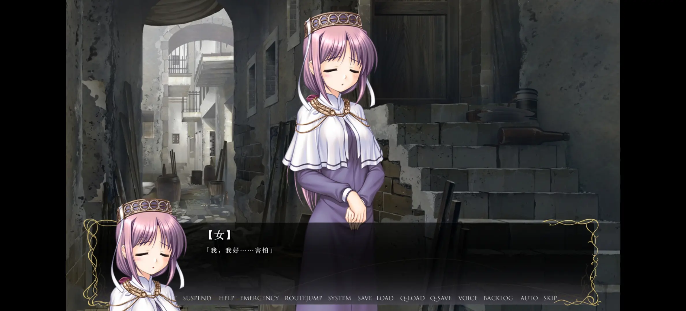
- `LARGE = 36`
    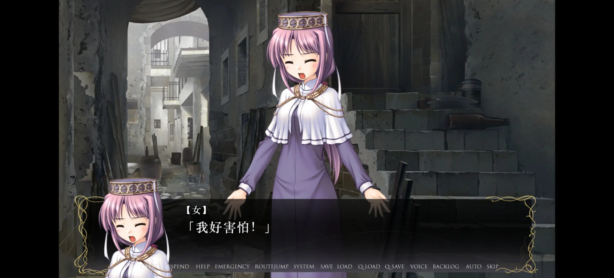

### 关于存档文件

解决换行问题时，我在某处长文本快速存档，在游戏目录放置修改过的 `.asb` 文件后，重启游戏，快速读取，结果依然有硬换行，历史记录也有，跳转到历史记录的其他长文本也是一样，并未生效；然而如果在标题页面点击 START，长文本却全部正常，没有硬换行；如果继续快进到之前的存档位置，长文本又变得正常了；此时快速读取，又不正常了，这是怎么回事？

既然点击 START 正常，说明自己放置的新 `.asb` 一定可以被成功读取，那么，不生效的情况很有可能是根本没有从 `.asb` 读取。观察到跳转到历史记录的第一条（也就是最远的一条）文本后，历史记录没有更早的文本，说明历史记录从存档文件读取，而不是从 `.asb` 读取，否则任意时刻都应当可以回溯到之前的任意位置。这也可以解释上述的奇怪现象：修改 `.asb` 后硬换行依然存在，是因为确实没有读取 `.asb`，而是读取存档文件，存档文件中存储的是修改 `.asb` 之前的文本，所以还有硬换行。

为了验证，我打开了 `quicksave.dat`，前 32 位为

```
42 4F 57 53 EB 03 00 00 99 28 04 00 78 DA EC 9D
07 5C 13 E7 FB C0 D9 4B 6C ED 1E 76 D8 D6 6E AB
```

我对逆向二进制文件并不熟悉，文件头 `BOWS` 也不对应常见的格式，于是把前几万位输入给 AI 分析，AI 注意到第 12 和 13 位是 `78 DA`，对应 Zlib 格式，顺便写出了解压代码：

<details>
<summary>点击展开</summary>

```python
import os
import struct
import zlib

def unpack_save(input_path: str, output_path: str) -> None:
    """解压 BOWS 格式存档文件"""
    if not os.path.exists(input_path):
        raise FileNotFoundError(f"未找到输入文件: {input_path}")

    with open(input_path, "rb") as f:
        data = f.read()

    if len(data) < 12 or data[:4] != b"BOWS":
        raise ValueError("无效的存档文件：文件头缺少 BOWS 标识")

    # 读取标头 (0x00-0x0B)
    _, comp_size, uncomp_size = struct.unpack("<4sII", data[:12])

    # 解压 0x0C 之后的 Zlib 字节流
    try:
        decompressed_data = zlib.decompress(data[12:])
    except zlib.error as e:
        raise ValueError(f"Zlib 解压失败: {e}") from e

    # 写入解压后的数据
    with open(output_path, "wb") as f:
        f.write(decompressed_data)

    print(
        f"[成功] 文件已解压 -> {output_path} (解压后大小: {len(decompressed_data)} 字节)"
    )

if __name__ == "__main__":
    unpack_save("quicksave.dat", "savefile_decompressed.bin")
```

</details>

打开解压后的文件，发现依然是二进制文件，但是有非常多明文内容，粗略浏览发现有明文台词，于是分别搜索游戏内历史记录的第一句和最后一句，发现正好是文件包含台词的第一句和最后一句，印证了刚才的猜想。

由此可以得知，快速读取之后，虽然这一句不正常，但存档文件只存到这一句，之后游戏就会从修改后的 `.asb` 读取，后续文本都应当是正常的，因此读档后可以放心继续游玩。

### 关于 pfs-tool

在[修复 OP 及其他视频](#修复-op-及其他视频)时，我担心新装版引擎可能只能解析 MPG 格式的视频，导致封包内的 12 个 OGV 也无法播放，保险起见，我决定把 12 个 OGV 也一并转换成 MPG。

最初在 GARbro 发现 12 个 OGV 视频并尝试提取时，没有注意到 GARbro 将 OGV 认为是“音频”类型，也就没有在意提取时默认勾选的“将音频转换为常规格式”，这直接导致提取失败，并让我认为 GARbro 没有提取 OGV 的能力，而我当时恰好忘记了 msg_tool 也可以提取 `.pfs`，于是在 GitHub 搜索 `Artemis engine`，第三个结果就叫做 [pfs_upk](https://github.com/nextgal/pfs_upk)，用其成功将 `root.pfs` 解包，才得到这 12 个 OGV。

`root.pfs` 的 `voice/` 文件夹下有 37923 个 OGG 音频文件，用 pfs_upk 提取 `root.pfs` 的话会一并将其提取出来，非常浪费时间，因此我看到 `movie/` 的 12 个 OGV 提取完成后就 `Ctrl` + `C` 终止任务。但批量方案要是这么写就太不优雅了，最好有一个能够提取文件内指定目录的命令行工具，然而搜索并未发现满足需求的工具。

“或许可以自己改一个？”我萌生了这样的想法。发现 pfs_upk 的代码似乎很简单，包括 CMake 在内的代码文件只有 11 个，不过我的 C++ 知识仅限于信息竞赛，工程实践方面并未涉猎，也不打算理解 `.pfs` 的具体算法，于是直接用 pfs_upk 的代码询问 AI 是否容易实现我的需求，AI 说非常容易，因为 `.pfs` 就像 ZIP 一样，也维护了一个文件索引，支持随机访问（不同的是 `.pfs` 的文件索引在头部）。

于是 fork 一份让 AI 修改代码，实现我的需求。原本 pfs_upk 的用法是

> `pfs_upk <FILENAME.pfs>` for unpack.  
> `pfs_upk <PATH>` for pack.

我支持了指定路径提取的功能，顺便增加了列出指定路径文件的功能，把名字改成 pfs-tool，用法如下：

```bash
# List files or directories in an archive
pfs-tool list <FILENAME.pfs> [PATH] [-r/--recursive]

# Unpack an archive
pfs-tool unpack <FILENAME.pfs> [PATH]

# Pack a directory into an archive
pfs-tool pack <PATH> [OUTPUT]
```

比如 `pfs-tool unpack root.pfs movie` 就会在当前目录生成 `root/movie/`，包含 12 个 OGV。

直到完成三个子命令的测试并发布完 release 之后，我才发现，只要在 GARbro 提取时取消勾选“将音频转换为常规格式”，就可以成功提取 OGV。也就是说，走到这一步就是个乌龙。更乌龙的是，后来我在游戏内玩到了某个 OGV 视频，遂将 `movie/` 删除以测试，发现依然可以正常播放，也就是说，引擎是有播放 OGV 的能力的，其实没有必要转换成 MP4。

但这也并非毫无意义，毕竟 GARbro 不支持 CLI，而支持 CLI 的工具似乎没有支持指定路径提取的，使用 pfs-tool，可以写出“换行”一节的[批量处理代码](#参考批量处理代码)。

> 在测试打包子命令 `pack` 时，还发现了一个意料之外的现象：将 `image/`, `system/`, `/scenario`, `movie/` 全部打包成 `root.pfs.001`（`001` 的读取优先级大于 `000`，依然来源于[这一篇文章](https://www.bilibili.com/opus/568495301662731170)，实验还证明 `000` 的优先级大于无数字后缀的 `root.pfs`），发现前三个文件夹全部生效，但 `movie/` 内的 OP 没有生效，此时在封包外放置 `movie/movie.mpg` 即可生效，这说明 OP 是不从封包内读取的。

## 环境与工具版本

### 环境

- Windows 11
    - Python 3.10.11
        - `fontTools==4.56.0`
- 一加 13
    - 骁龙 8 Elite
    - Android 15
    - ColorOS 15

### 工具版本

- Winlator [11.1 (Final)](https://github.com/brunodev85/winlator/releases/tag/v11.1.0)
- Tyranor v2.3.4
    - [Telegram](https://t.me/Tyranor/13)
    - [GitHub](https://github.com/tyranor2/TyranorRelease/releases/tag/2.3.4)
        - 不确定是否为官方，但 SHA256 与 Telegram 版本相同。
        - <details>
            <summary>SHA256</summary>

            `23c799b1fd93cdf756a6eb0037a979a9b7d0b680dab69f9dd74e6a46ac293b64`
            </details>
- GARbro [Version 1.5.44](https://github.com/morkt/GARbro/releases/tag/v1.5.44)
- artemis-engine-port-tools [3afd534](https://github.com/ATSPwang618/artemis-engine-port-tools/blob/3afd534c976a928463713099981e885243d14af2/asb%E8%A7%A3%E5%AF%86%E6%9F%A5%E7%9C%8B%E6%96%B9%E6%B3%95%E8%AF%B4%E6%98%8E.zip) 中的 `asbutil.exe`
- msg-tool [v0.4.0-alpha.3](https://github.com/lifegpc/msg-tool/releases/tag/v0.4.0-alpha.3)
- asb_parser [e863503](https://github.com/kongbaiz/asb_parser/tree/e8635038108ddba5bb0571eb23a5c7bca3312c62)
- FFmpeg [version 2026-07-20-git-c23123630e-full_build](https://github.com/GyanD/codexffmpeg/releases/tag/2026-07-20-git-c23123630e)
- pfs_upk [1.1.0](https://github.com/nextgal/pfs_upk/releases/tag/1.1.0)
- pfs-tool [v2.0.0](https://github.com/788009/pfs-tool/releases/tag/v2.0.0)

## 讨论

可在 [B 站专栏](https://www.bilibili.com/opus/1229744107207786501)评论区讨论。
