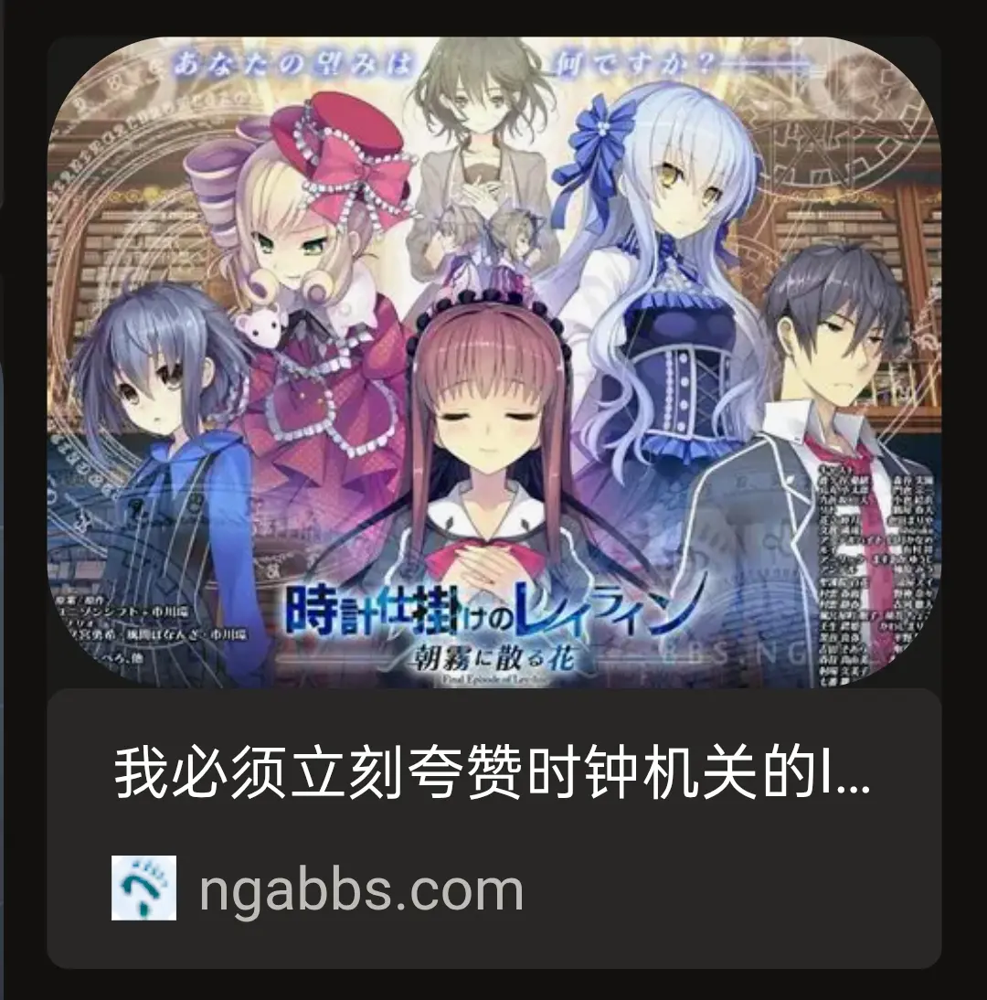
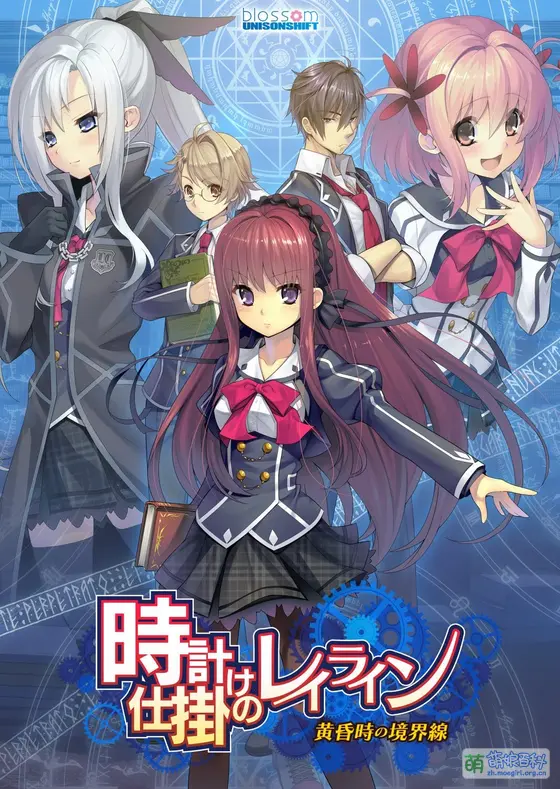
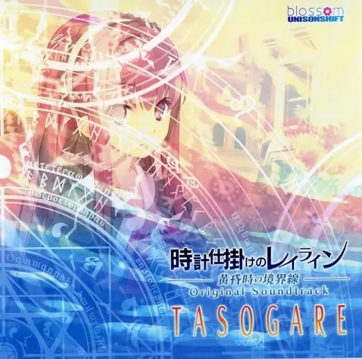

朋友让我帮忙找找这张图。

面对这张 `80 x 108` 的图片，我自然是不抱希望，纯粹是试一试的心态。

首先当然是常规的 [SauceNAO](https://saucenao.com/) 和 [Google Lens](https://lens.google.com/)，不出意外地，一无所获。

接着尝试搜索图中的文字，只能看清 `レイ`、`ン`、`TASOGA?E`。`TASOGA` 和 `TASOGARE` 搜出来全是咖啡店，但这张图明显不是咖啡店，搜 `TASOGAIE` 的话，搜索引擎会认为我写错了，也搜不出有用的结果。

走投无路，尝试让 Gemini 识别文字，回答如下：

> 图中显示的文字为：  
> **時ノ楼のレイリン**  
> **TASOGARE**

搜索 `時ノ楼のレイリン` 也没有结果。

但这时觉得图中的汉字确实有点像 `時` 和 `楼`，再加上可以确定的 `レイ` 和 `ン`，尝试搜索 `時 楼 レイ ン`，一张图引起了我的注意：

[图中帖子](https://ngabbs.com/read.php?tid=35222669) 的主题是《時計仕掛けのレイライン》这款 Galgame，原图看起来也确实像 Galgame。而观察图片本身，可以注意到，文本 `時計仕掛けのレイライン` 的排版与原图相应部分的排版十分相似，而且原图下面似乎也有一个副标题。

这很有可能就是答案，于是我搜索这个游戏，点开[萌娘百科](https://zh.moegirl.org.cn/%E6%97%B6%E9%92%9F%E6%9C%BA%E5%85%B3%E7%9A%84Leyline)，看到下面这个游戏封面：

这是关键证据，可以看到原图的女孩是红发紫瞳，而上面这张图中央的女孩恰好也是红发紫瞳！其次，原图左上角有一个疑似会社的 logo，分为两行，第一行是蓝字，右半部分有一抹红色，第二行只能看到一片蓝色，这与上面这张图顶部的 UNiSONSHIFT\:Blossom 的 logo 一模一样。另外，原图和这张图都有不少魔法阵图案。

至此，可以完全确定原图就出自《時計仕掛けのレイライン》。

最后是找到原图：搜索 `時計仕掛けのレイライン TASOGA`，果不其然，成功了：

这张图就是《時計仕掛けのレイライン－黄昏時の境界線－》的 OST 封面。

前后一共花了 10 分钟，发现发色瞳色匹配时我是很兴奋的，奇迹一般。
