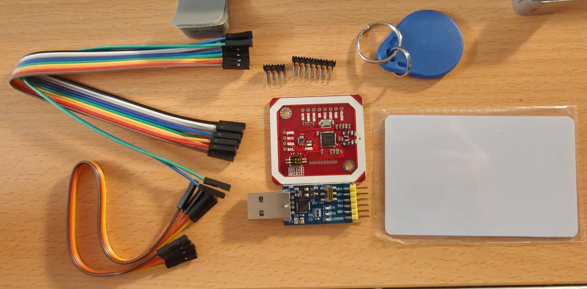
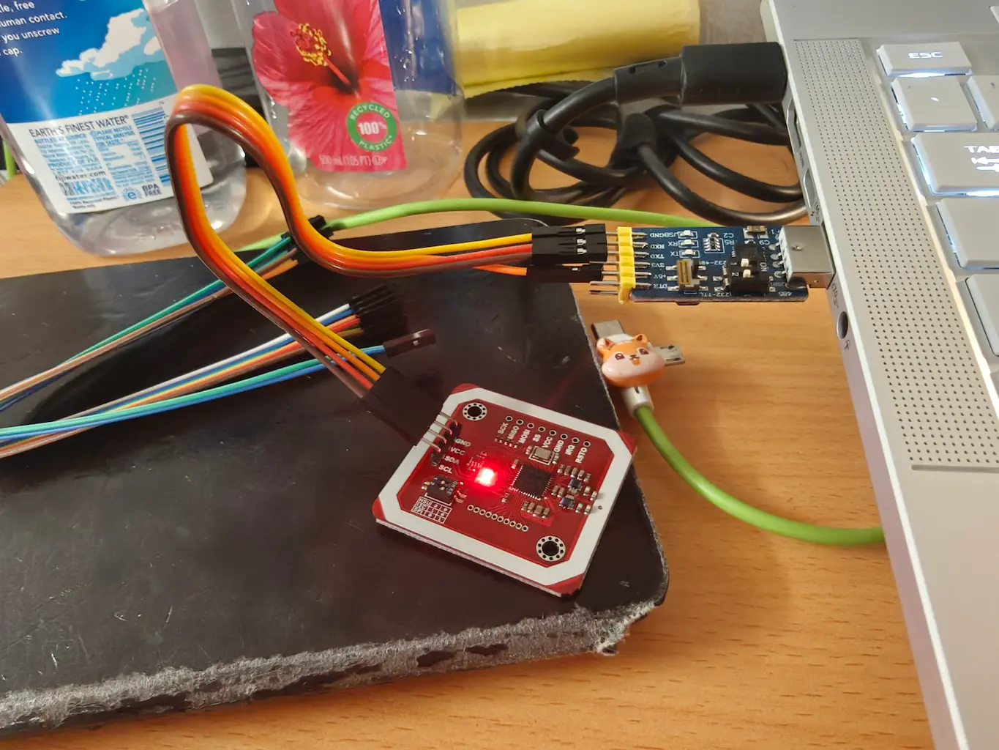
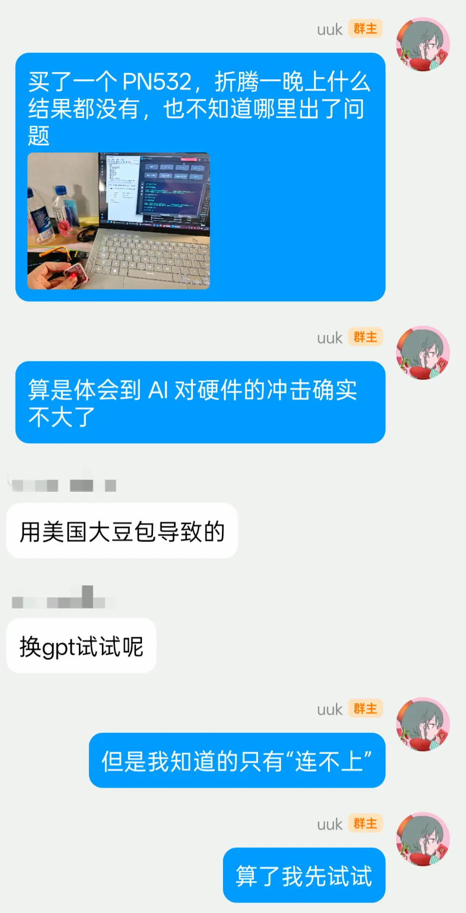
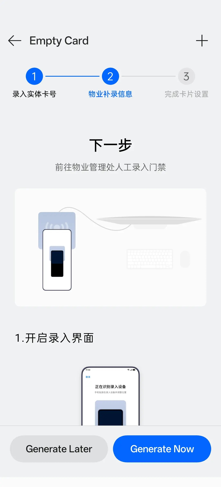

<details>
<summary>目录</summary>

- [初探](#初探)
- [搭建硬件](#搭建硬件)
- [破解加密](#破解加密)
- [复制到手机](#复制到手机)
- [其他](#其他)
- [环境与工具](#环境与工具)
    - [环境](#环境)
    - [硬件](#硬件)
    - [软件](#软件)

</details>

宿舍房间使用 NFC 房卡开门，卡是水滴形的钥匙扣卡，我一般将其放在书包内，因此每次回房间都要先半脱下书包，拿出房卡，再开门，很麻烦。

我的一加 13 有一个自带的“钱包”软件，支持复制未加密的门禁卡，于是尝试复制房卡，显示有加密，可能无法使用，事实的确如此，无法开门，这也说明宿舍门禁读取了房卡的加密扇区，而不仅仅是卡的 UID。

如果能将房卡复制到手机，然后使用手机的 NFC 模块开门，那将非常方便，因为每次我回房间的时候手上一定拿着手机。

## 初探

我之前看过一个视频，说 NFC 卡的加密大部分都可以破解。既然手机有 NFC 模块，自然先用手机尝试。询问 Gemini 后，下载 [MIFARE Classic Tool](https://github.com/ikarus23/mifareclassictool)，直接读取卡片，软件枚举了内置的两千多个密钥之后，解出了两个扇区，分别是 Sector 1 和 Sector 2，如下（已脱敏，后文的 `*` 相同）。

```
Sector 1
5B****************************23
5B****************************23
00000000000000000000000000000000
2A**********FF078069FFFFFFFFFFFF

Sector 2
00000000000000000000000000000000
00000000000000000000000000000000
00000000000000000000000000000000
FFFFFFFFFFFFFF078069FFFFFFFFFFFF
```

其他扇区全部未知，Gemini 和我说手机 NFC 模块不具备破解密钥的能力，这是软件无法解决的，必须使用专门的硬件设备，如 PN532。

Gemini 还说，已知的 Key（即 `2A**********` 和 `FFFFFFFFFFFF`）是有了 PN532 之后执行 Nested 或 HardNested 攻击的必要条件。

在 Amazon 搜索，发现 PN532 是一小块红色的电路板，不贵，HiLetgo 品牌的只要 8 美元，另外还需要一个 TTL to USB 模块，7.5 美元。

我对这类硬件没有任何经验，但一直想尝试，何况现在还有 AI，门槛应当不高，于是购买两样组件。

## 搭建硬件

几天后到货了。



红色的是 PN532，环绕的白色线圈是天线，也就是负责 NFC 感应的区域，Gemini 说调整至 HSU (High Speed UART) 模式后，将四个排针孔（而不是八个）与蓝色的 CP2102（有 USB-TTL 功能）用杜邦线连接，PN532 的四个排针孔正面分别写的是 `GND`, `VCC`, `SDA`, `SCL`，背面对应是 `GND`, `VCC`, `TXD`, `RXD`，CP2102 的六个针脚分别写着 `DTR`, `+5V`, `3V3`, `TXD`, `RXD`, `GND`，含义如下：

| 标记 | 英文全称 | 中文含义 |
| --- | --- | --- |
| `VCC` | Voltage at the Common Collector | 电源正极 |
| `+5V` | 5 Volt Power | 5伏电压输出 |
| `3V3` | 3.3 Volt Power | 3.3伏电源输出 |
| `GND` | Ground | 电源负极 / 接地 |
| `TXD` | Transmit Data | 数据发送端 |
| `RXD` | Receive Data | 数据接收端 |
| `SDA` | Serial Data Line | 串行数据线 |
| `SCL` | Serial Clock Line | 串行时钟线 |
| `DTR` | Data Terminal Ready | 数据终端就绪（刷写程序时用于自动复位） |

按照如下方法连接：

| PN532| CP2102 |
| --- | --- |
| `GND` | `GND` |
| `VCC` | `+5V` |
| `SDA` / `TXD` | `RXD` |
| `SCL` / `RXD` | `TXD` |

第一次连杜邦线，不敢插得太深，导致连接非常松，经常一端连好另一端已经掉了，加上 PN532 一端没有焊接，也非常松，经过反复尝试，终于让 PN532 亮起了表示电源的红灯。



在 [Silicon Labs](https://www.silabs.com/software-and-tools/usb-to-uart-bridge-vcp-drivers?tab=downloads) 下载驱动，在设备管理器安装，之后便显示该设备运转正常。

下载 [MifareOne Tool](https://github.com/xcicode/MifareOneTool)，检测连接，却输出

```
开始执行检测设备……
nfc-bin/nfc-scan-device.exe 使用libnfc 1.7.1
未找到NFC设备.


识别了以下设备：
没有发现任何有效的NFC设备。
请检查接线是否正确/驱动是否正常安装/设备电源是否已经打开（对于具有电源开关的型号）。
##运行完毕##
```

Gemini 说大概率是 PN532 没有焊接容易接触不良，红灯亮起只能说明 `GND` 和 `VCC` 供电正常，而 `TXD` 和 `RXD` 传输数据对接触不良非常敏感。于是我花了几个小时调整姿势，没有一次成功。

中途发现 CP2102 也有两个开关，便拍照询问 Gemini 是什么，Gemini 说用于工作模式切换和 RS485 终端电阻使能，我的需求都不需要开启，保持 OFF 状态即可。

后来怀疑是不是软件的问题，又下载了一个 [NFCToolsGUI](https://github.com/GSWXXN/NFCToolsGUI)，结果一样找不到设备，输出：

```
error	libnfc.driver.pn532_uart	pn53x_check_communication error 
ERROR: Unable to open NFC device: pn532_uart:COM4:115200
```

值得一提的是，MifareOne Tool 检测一次要 20 到 30 秒，而 NFCToolsGUI 只要一秒，因为后者让用户从可用的串口中选择，之后只检测这一个串口，而前者会检测所有串口，因此检测时使用 NFCToolsGUI 效率更高。

四五个小时后，走投无路，只能认为是硬件本身有问题，运气不好，打算放弃，在群里分享。

<picture>
    <source media="(prefers-color-scheme: dark)" srcset="images/qq-chat-dark.webp">
    <source media="(prefers-color-scheme: light)" srcset="images/qq-chat.webp">
    
</picture>

有群友建议我从 Gemini（即“美国大豆包”）换成 ChatGPT，我一开始觉得是我自己掌握的知识不够，因此只能知道“连不上”这样的信息，AI 自然帮不了我。但反正已经走投无路，不如死马当活马医，试试 ChatGPT。

我向 ChatGPT 详细描述了我的情况：

```
PN532 已经调整至 HSU 模式，和 CP2102 用杜邦线连接，GND, VCC, SDA,  SCL 分别连接 GND, 5V, RXD, TXD，没有焊接，而是用手将针脚倾斜按压，我认为按得挺紧，现在 PN532 的 PWR 亮红灯，win11 显示 Silicon Labs CP210x USB to UART Bridge (COM4) “运转正常”，NFCToolsGUI 选择 COM4 后 CP2102 亮起绿灯，1 秒后软件显示 error	libnfc.driver.pn532_uart	pn53x_check_communication error 
ERROR: Unable to open NFC device: pn532_uart:COM4:115200，交换 RXD 和 TXD 之后也不行，CP2102 有两排针脚，换另一排也不行，换另一排再交换 RXD 和 TXD 也不行，四条杜邦线都可以用来供电，说明杜邦线没问题，怎么办
```

发现其回答有一句“通常是 ELECHOUSE PN532 V3”，后续都基于这个假设，于是我修改提示词，明确指出 PN532 的型号是 HiLetgo NFC NXP RFID Module V3，CP2102 的型号是 HiLetgo CP2102 USB to TTL UART 232 485（不过后来发现 PN532 背面就写着 ELECHOUSE）。ChatGPT 提到两个问题，一个是裸按的接触问题，建议我焊上（当然我没这个条件）；另一个是确认 CP2102 是否正常工作：ChatGPT 说 CP2102 的两个开关都应当是 OFF（与 Gemini 说的一样），然后让我用杜邦线短接 CP2102 的 `RXD` 和 `TXD`，运行 Python 代码：

<details>
<summary>点击展开</summary>

```python
import serial
import time

port_name = "COM4"

ser = serial.Serial(
    port=port_name,
    baudrate=115200,
    bytesize=serial.EIGHTBITS,
    parity=serial.PARITY_NONE,
    stopbits=serial.STOPBITS_ONE,
    timeout=1,
    xonxoff=False,
    rtscts=False,
    dsrdtr=False,
)

print("串口打开:", ser.is_open)

# 清空缓冲
ser.reset_input_buffer()
ser.reset_output_buffer()

send_data = b"Loopback Test\r\n"

print("发送:", send_data.hex(" "))

n = ser.write(send_data)
ser.flush()

print("实际发送字节数:", n)

time.sleep(0.2)

received = ser.read(ser.in_waiting)

print("收到字节数:", len(received))
print("收到 HEX:", received.hex(" "))
print("收到文本:", repr(received))

if received == send_data:
    print("✅ CP2102 TX/RX Loopback 成功")
else:
    print("❌ CP2102 TX/RX Loopback 失败")

ser.close()
```

</details>

输出：

```
串口打开: True
发送: 4c 6f 6f 70 62 61 63 6b 20 54 65 73 74 0d 0a
实际发送字节数: 15
收到字节数: 0
收到 HEX:
收到文本: b''
❌ CP2102 TX/RX Loopback 失败
```

说明 CP2102 有问题，我把结果告诉 ChatGPT，ChatGPT 搜索了一番后回答，之前说错了，CP2102 的两个开关不应该都拨 OFF，而应该分别是 ON 和 OFF，查看其搜索来源，[这个](https://www.scribd.com/document/684156798/6-in-1-Serial-Converter-Manual)和[这个](https://manualzz.com/doc/81100197/diymalls-cp2102-usb-to-ttl-serial-adapter-module-usb-to-r...)网站确实都提到 USB-TTL 模式需要将 Switch 1 (USB) 调整至 ON，将 Switch 2 (485) 调整至 OFF。

照做，立竿见影，短接 CP2102 后 Python 程序输出

```
串口打开: True
发送: 4c 6f 6f 70 62 61 63 6b 20 54 65 73 74 0d 0a
实际发送字节数: 15
收到字节数: 15
收到 HEX: 4c 6f 6f 70 62 61 63 6b 20 54 65 73 74 0d 0a
收到文本: b'Loopback Test\r\n'
✅ CP2102 TX/RX Loopback 成功
```

连接 PN532 后，NFCToolsGUI 选择 COM4 后输出

```
NFC device: NFC_Device opened
```

MifareOne Tool 检测连接也输出

```
找到 1 个NFC设备:
- pn532_uart:COM4:
    pn532_uart:COM4:115200
```

至此终于拥有使用 PN532 的能力了。

## 破解加密

MifareOne Tool 有一个功能是“知一密破解”，输入 `FFFFFFFFFFFF,2A**********` 后，未能找出所有扇区的密钥，输出明确写着“该卡片不受Nested攻击”，NFCToolsGUI 也一样输出 Card is not vulnerable to nested attack。

Nested 是基于弱伪随机数容易预测的攻击方式，看来宿舍房卡使用的伪随机数没有这个漏洞。接下来先尝试用 NFCToolsGUI 的内置字典进行爆破，花费八十多分钟，结果六万多个密钥无一命中。

然后是 HardNested，这种方法利用 Crypto-1 算法内部状态泄露的密码学缺陷来攻击，同样需要至少一个扇区的密钥，这样才能对该扇区进行认证。

MifareOne Tool 没有看到 HardNested 字样，于是尝试 NFCToolsGUI，首先收集数千个 [Nonce](https://en.wikipedia.org/wiki/Cryptographic_nonce)，收集完成后进行并发计算，然而，收集 1986 个 Nonce 之后，软件却输出：

```
Collected 1986 nonces... leftover complexity 1668596975616 (~2^40.60)

### 开始执行 HardNested 解密

exit code: 3221225781 
```

这属于 Windows 系统的 `STATUS_DLL_NOT_FOUND` 错误，也就是缺少需要的 DLL。查看仓库，README、Issues 和 PR 均无类似问题，检查下载的软件压缩包和解压结果，文件数量相同，排除杀毒软件原因。

看来找不到需要的库，便搜索 `hardnested` 寻找其他工具，搜索到一个仓库叫做 [mfoc-hardnested](https://github.com/nfc-tools/mfoc-hardnested)，从 README 来看是可以解决我的问题，只不过没有 Release，需要自己用 Visual Studio 2019 或 MSYS2 编译。

我装完 MSYS2 突然想到，NFCToolsGUI 没理由不附带需要的库，于是打开 [Everything](https://www.voidtools.com/zh-cn/) 搜索 `hardnested`，确实搜索到了一个 `libnfc_hardnested.exe`，不过位于 MifareOne Tool 的目录下。

难道 MifareOne Tool 其实有 HardNested 功能？我再次观察软件界面，发现有一栏“高级操作模式”，点开，真的有 HardNested，已知 Key 输入 `FFFFFFFFFFFF,2A**********`，目标扇区 0 的 Key A，执行！

```
开始执行HardNested解密强化卡……
Hardnested Crack with libnfc
Compiled by XAS-712
NO ILLEGAL USE.

发现卡片，UID=32******, 正在收集Key A的Nonce =>> Block 3(位于Sector 0)，已知KeyA=2a********** 对于Block 7(位于Sector 1)是正确的。

已经收集 0 个Nonce... 
已经收集 10 个Nonce... 
已经收集 20 个Nonce... 
已经收集 31 个Nonce... 
...
已经收集 1658 个Nonce... 
已经收集 1668 个Nonce... 
已经收集 1678 个Nonce...
收集了 1688 个Nonce...剩余复杂度 1668596975616 (~2^40.60)正在初始化计算...
开了 16 个线程，正在计算 1668596975616 种状态(使用 64-way bitslicing)…

正在计算...   0.00%
正在计算...   0.00%
正在计算...   0.02%
正在计算...   0.05%
...
正在计算...  57.18%
正在计算...  57.20%
正在计算...  57.21%
已计算得目标Key = [20**********]
Tested 954666028842 states
```

收集与计算共耗时两个多小时（毕竟测试了九千亿个状态），计算时 CPU 的 16 核占用几乎都是 100\%，温度始终维持在 95℃，好在最后成功了，说明房卡的安全性也不过如此。

我把结果告诉了 Gemini 和 ChatGPT，Gemini 说利用 Sector 0 Key A 和 Sector 1 Key A，直接改用标准的 Nested 攻击，即可在几秒钟内快速破译卡片中剩余的所有扇区并导出完整 Dump 文件，而 ChatGPT 让我对其他扇区继续 HardNested 计算密钥。

我没多想，打开 MifareOne Tool 的“知一密破解”（即 Nested），输入已知密钥 `FFFFFFFFFFFF,2A**********,20**********`，结果 `全部扇区成功解密`，并输出了全部 32 个扇区的数据，最后保存成 2 KB 的 `.dump` 文件。

至此加密全部破解完成。

不过事后复盘时我注意到，Nested 攻击是基于弱伪随机数的漏洞，多知道一个密钥并不会改变卡内置的算法，之前 Nested 攻击无效，之后也不可能改变，所以 Gemini 说得不对，我向 Gemini 提出这一点，Gemini 承认确实如此，之前的说法“存在技术概念上的错误”。

但事实上“知一密破解”成功了，这又是为什么呢？MifareOne Tool 在 `全部扇区成功解密` 之前输出了所有扇区的所有密钥，并说 `太没意思了全是默认密钥...`，我当时下意识认为指的是软件内置的默认密钥，直到我仔细查看输出的各扇区密钥，发现全是 `FFFFFFFFFFFF,2A**********,20**********` 的其中之一。原来“默认密钥”的意思是我输入的这三个已知密钥，而“知一密破解”能够成功，也是因为在尝试攻击之前，软件会先对所有扇区尝试使用已知密钥进行认证，而正好其他未知扇区的密钥都是已知密钥之一，自然全部认证成功。Nested 攻击还没开始就结束了，所以与原理并不矛盾。ChatGPT 的思路是正统的，但从结果来看，是 Gemini 的错误回答让我碰上这个巧合，快速解决了问题。

值得注意的是，根据软件输出的扇区数据，可以发现房卡的 Sector 2 和 Sector 16~31 全部都是空的，也就是说虽然是 32 个扇区的 2K 卡但只用到了 15 个扇区。

另外，每个 Nonce 都会提供约束，使程序将初始 $2^{48}$ 的搜索空间通过高效的算法减少，比如此次就减少到了约 $2^{40.60}$，这只需要几秒钟，接下来的漫长时间都在把剩余的可能解逐一代入 Crypto-1 算法，检验函数值与收集的 Nonce 中对应的值是否相同，若全部相同，则说明该解为正确密钥。此次程序只收集了 1688 个 Nonce（或者 NFCToolsGUI 收集了 1986 个，将搜索空间降低到了与 MifareOne Tool 一模一样的规模），若能多收集一些，比如 3000~4000 个，剩余解数量很可能会有可观的减少。

## 复制到手机

一加 13 的“钱包”软件有两种添加门禁卡的方式，一种是直接复制，即文章开头提到的方法，因为卡有加密，行不通；另一种是先创建空白卡，然后在物业使用物业的录入设备进行录入。

<picture>
    <source media="(prefers-color-scheme: dark)" srcset="images/white-card-dark.webp">
    <source media="(prefers-color-scheme: light)" srcset="images/white-card.webp">
    
</picture>

之前安装在手机上的 MIFARE Classic Tool 没有模拟卡片的功能，搜索也没有找到能导入卡数据的 NFC 模拟软件，就算有 root 也不行。

很显然我不可能找宿舍管理人员说我要复制房卡，所以我的初步想法是先用 PN532 把卡数据不加密地写到一张空白卡上，再用钱包软件复制。

PN532 附赠了两张空白卡，说干就干，在 MifareOne Tool 选择“写(UF)UID卡”，却报错 `文件中的UID校验码-BCC错误!`，无法写入；选择“写C/FUID卡”，选择 `.dump` 文件后报错“加载的S50卡文件大小异常”，尝试修复均失败。

于是更换 NFCToolsGUI，但 NFCToolsGUI 无法使用 MifareOne Tool 导出的 `.dump` 文件，于是先“已知密钥解卡”，保存为 `.mfd` 文件（这里注意保存位置在存放用户文件的目录下的 `dumpfiles/` 文件夹，存放用户文件的目录可以在 [README](https://github.com/GSWXXN/NFCToolsGUI/blob/main/README-zh_CN.md#%E7%9B%AE%E5%BD%95%E4%BD%BF%E7%94%A8) 找到，Windows 下是 `%APPDATA%\NFCToolsGUI`，解卡成功后自动保存，没有提示），然后“一键写卡”（会自动打开存放用户文件的目录以选择文件），输出：

```
NFC reader: NFC_Device opened
Found MIFARE Classic card:
ISO/IEC 14443A (106 kbps) target:
    ATQA (SENS_RES): 00  04  
       UID (NFCID1): 04  **  **  **  **  **  **  
      SAK (SEL_RES): 08  
RATS support: yes
Guessing size: seems to be a 1024-byte card
Writing 63 blocks |...............................................................|
Done, 63 of 64 blocks written.
```

写入成功了，不过只由于附赠的空白卡是 1K 卡，只写了 63 个块（Block 0 由于一般无法写入被自动跳过了），即 16 个扇区，也就是说自动丢弃了后一半数据。

尝试开门，失败，门禁没有任何反应，连错误的反应都没有。

不过后来用 PN532 读取写入后的空白卡，发现连加密一起写上去了，所以就算可以开门也无法直接复制到手机上。

很快我又产生了一个有些异想天开的点子：物业的录入设备是否其实就是对手机执行了一次写卡操作？如果是，那能不能直接用 PN532 充当录入设备？

该流程的第一步是使用原卡复制 UID 并创建空白卡，实际上填入了之后会跳过的 Block 0 的数据，之后才是上图的界面。

进入物业录入步骤后，将手机 NFC 感应区域靠近亮着红灯的 PN532，在 NFCToolsGUI “一键写卡”并选择导出的 `.mfd` 文件，再次输出：

```
NFC reader: NFC_Device opened
Found MIFARE Classic card:
ISO/IEC 14443A (106 kbps) target:
    ATQA (SENS_RES): 00  04  
       UID (NFCID1): 04  **  **  **  **  **  **  
      SAK (SEL_RES): 08  
RATS support: yes
Guessing size: seems to be a 1024-byte card
Writing 63 blocks |...............................................................|
Done, 63 of 64 blocks written.
```

手机点击确认，卡片创建完成。

尝试开门：

<video controls preload="metadata" width="100%">
  <source src="https://github.com/user-attachments/assets/a3dfa919-1477-4063-9fa2-71642846971f" type="video/mp4">
</video>

成功了。

这说明我的猜想是正确的，物业的录入设备确实仅执行写卡操作，与 PN532 相同。另外从 NFCToolsGUI 的输出可以发现，手机创建的空白卡也是 1K 卡，也只写入了一半的数据，但恰好原卡 Sector 16~31 是空的，实际也没有从中读取数据（比如校验是否存在 32 个扇区），这是手机可以模拟房卡开门的必要条件，房卡不抗 HardNested、没有滚动码机制等也是成功的一环。

一开始向 AI 说出我的需求时，无论是 Gemini 还是 ChatGPT 都说安卓的 NFC 模块不一定能模拟 MIFARE Classic 的底层认证流程，所以就算有破解后的卡数据文件也不一定能在手机上使用。Grok 也说空白卡 + 物业写卡模式基本是国内特有的，也就是说只有国产手机会做这个功能，实际上 Pixel 手机就无此功能，苹果手机更是根本不支持模拟门禁卡，因此一加 13 本身也是成功的一大因素。

## 其他

- 在硬件方面，ChatGPT 免费版（2026.9）的回答比 Gemini 3.6 Flash Extended thinking 更准确。
- 在完全没有知识的情况下，除了盲信 AI，还可以将各个开关状态排列组合。
- 很有意思，下学期也许可以选一个硬件相关的课程。

## 环境与工具

### 环境

- 2026.9
- Windows 11
    - Python 3.10.11
        - `pyserial==3.5`
- 一加 13 国行版
    - Android 15
    - ColorOS 15

### 硬件

- PN532: [Amazon](https://www.amazon.com/dp/B01I1J17LC)
- CP2102: [Amazon](https://www.amazon.com/dp/B00LZVEQEY)

### 软件

- 手机
    - MIFARE Classic Tool (MCT): [Version 4.3.1](https://github.com/ikarus23/MifareClassicTool/releases/tag/v4.3.1)
    - 钱包 (com.finshell.wallet): version 5.38.5_367c486_250701
- 电脑
    - MifareOne Tool: [v1.7.0](https://github.com/xcicode/MifareOneTool/releases/tag/v1.7.0)
    - NFCToolsGUI: [v1.0.0](https://github.com/GSWXXN/NFCToolsGUI/releases/tag/1.0.0)
