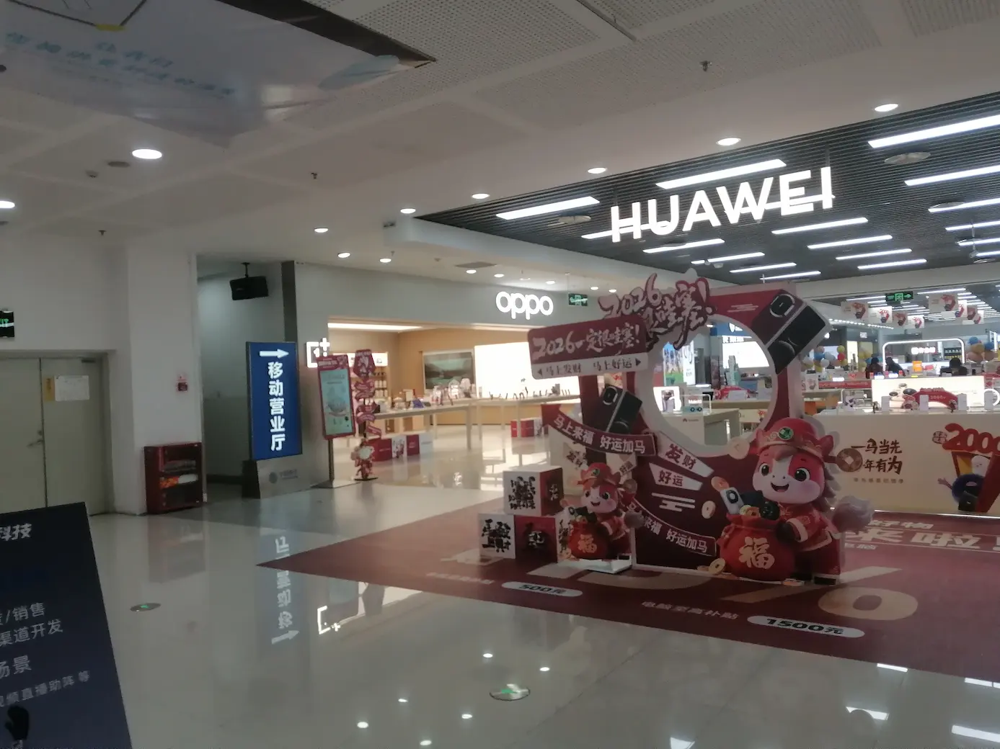
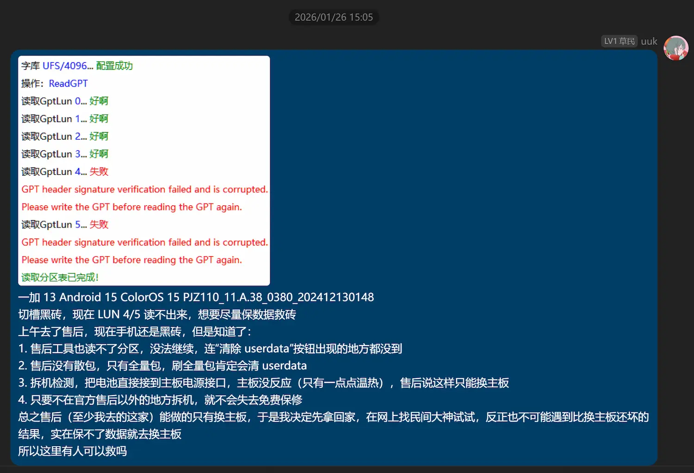
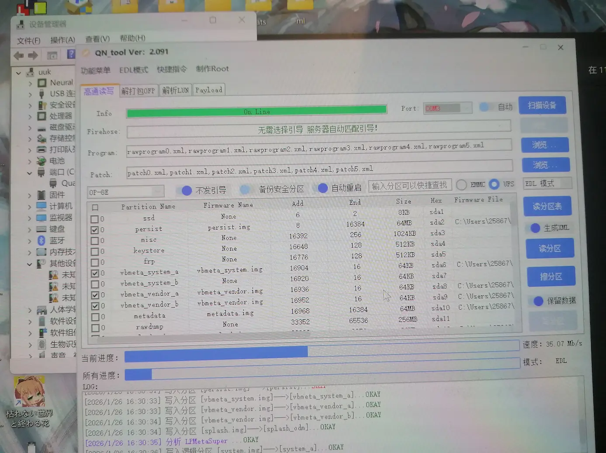
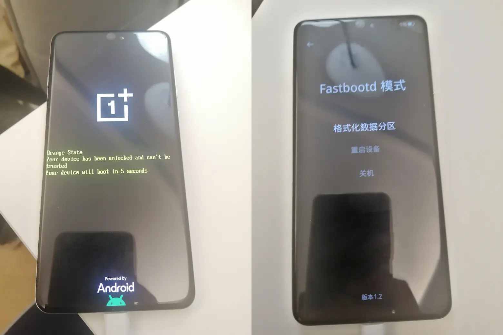
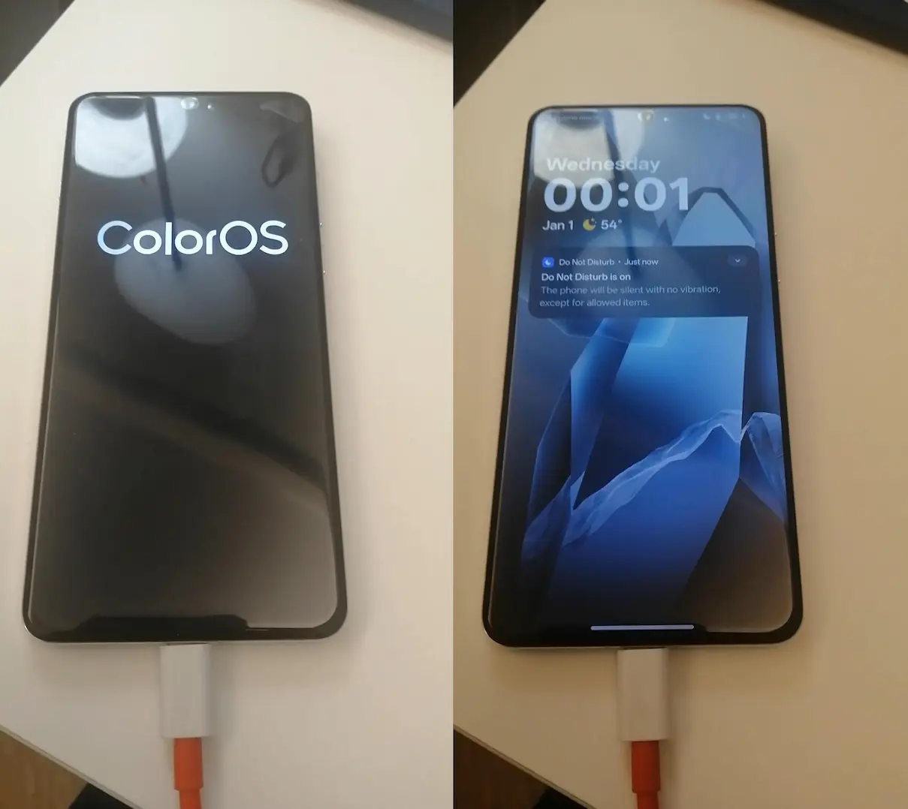
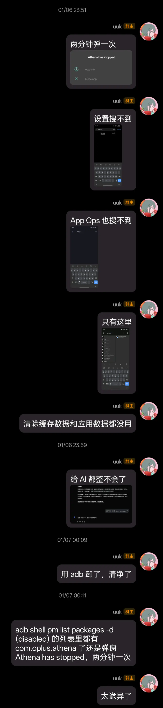
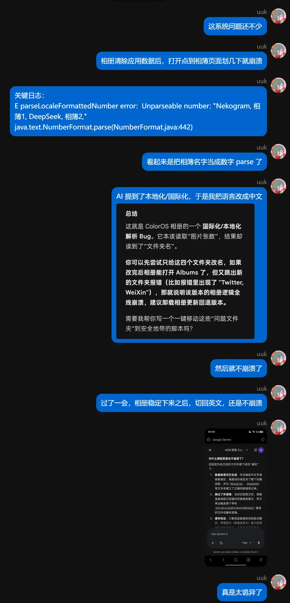

2026 年 1 月 24 日凌晨一点多，我的一加 13 警告我还剩 10% 的电量，我没有在意，打算剩余 5% 再充电，结果电量掉到 5% 之后 10 秒左右就关机了，还没来得及插上电源。

于是插电开机，振动、安卓 logo + orange state、一加 logo、ColorOS logo，然后黑屏，随即再次振动、安卓 logo + orange state、一加 logo、ColorOS logo，然后黑屏，随即再次振动...

## 环境

- 一加 13
- Android 15
- ColorOS 15
- PJZ110_11.A.38_0380_202412130148
- 2025 年 11 月 22 日使用 SukiSU Ultra 的 LKM 模式 Root
- 只刷了 [acc](https://github.com/VR-25/acc) 这一个模块，曾经 `acc -d` 过，但后来一直保持 `acc -e` 的状态

## 尝试

很快手机还开始剧烈发热。立即将其连接电脑，发现可以稳定识别 fastboot，在 ColorOS logo 阶段可以识别 adb。

在这个阶段尝试了
- 长按音量减（ksu 内置救砖模块，不过后来了解到只有 GKI 能用，而我使用的是 LKM）
- 用 fastboot 向 A 和 B 分区刷入原厂相同版本的 `init_boot.img`
- `fastboot set_active a`（为了重置 `slot-retry-count:a:7`）
- `fastboot erase misc`

上述任意步骤之后重启依然无限重启，即使充电至 `battery-soc-ok:yes` 也依然如此。

2:40 左右，Gemini 告诉我可能是 A 分区已经损坏，可以尝试切换至 B 分区。

```bash
fastboot set_active b
fastboot erase misc
fastboot reboot
```

最后一条命令刚按完回车，手机应声黑屏，不发热了，不循环重启了，不管怎么按按键也彻底没反应了。

## 黑砖

此时无法识别 adb 或 fastboot，只能 9008。

在这个阶段用 OplusEdlTool 往 A/B 分区刷过且只刷过 `init_boot`, `boot`, `vendor_boot`, `abl`, `xbl`, `xbl_config`, `vbmeta`, `vbmeta_system`, `imagefv`, `uefi`, `hyp`, `dtbo`，虽然某个阶段刷入了 2024 年 9 月（早于系统版本日期）的 `abl`, `xbl`, `xbl_config`，但之后又用与原系统相同版本的覆盖掉了。

之后 DeepSmartTool 发现分区表（GUID Partition Table, GPT）LUN 4/5 损坏（但无法确定是上面哪一步损坏的），尝试用旧版本的 rawprogram 修复 GPT，其中 LUN 1/2/3 修复成功，LUN 4/5 失败。

此外还用两个工具多次尝试切换分区和重启至 recovery/fastbootd/开机，切换分区操作两个工具都提示成功，但实际上都没有切换（这也降低了工具输出的可信度，有可能前面写入分区操作其实也没有成功），三种重启也都没有作用。

到此为止，手机本身没有任何反应（如振动、亮 logo），在上述任意步骤之后都尝试了电源键、音量加减的各种组合的长时间长按，没有作用。

此时认为只要把对应版本的 GPT 写上应该就能救活，但我手上没有散包。

一看时间，早上七点了，于是睡觉。

## 售后

下午 16:40 起床继续折腾，晚上八点左右决定找售后，当时手机还在免费保修期内。

那天晚上把酷安相关帖子翻遍了，计划是一定要让技术人员取消勾选“清除 userdata”选项，若成功进入 fastboot 则取消工单，拿回家自己继续刷，若非技术原因一定要清除数据，就换下一家售后，还不行就寄修，再不行就放弃保数据。

<details>
<summary>参考帖子</summary>

- https://www.coolapk.com/feed/67903316
- https://www.coolapk.com/feed/67941852
- https://www.coolapk.com/feed/67978928

</details>

1 月 26 日上午前往[厦门 SM 一期 4 楼的 OPPO 售后](https://support.oppo.com/cn/service-center/service-center-detail/#/?siteno=CN036002)。



当场拆机检测，把电池直接接到主板电源接口，主板没反应（只有一点点温热），售后说这样只能换主板，另外告诉我
- 售后工具也读不了分区，没法继续，连“清除 userdata”选项出现的地方都没到
- 售后没有散包，只有全量包，刷全量包肯定会清 userdata
- 售后不会关注民间工具，但是说民间大神可能可以
- 只要不在官方售后以外的地方拆机，就不会失去免费保修

总之售后（至少我去的这家）能做的只有换主板，于是我决定先拿回家，在网上找民间大神试试，反正也不可能遇到比换主板还坏的结果。另外售后还不错，主动提出先把主板订下去，过几天实在不行再去可以马上换。

## 结局

当天下午，抱着碰运气的想法，在 DeepSmartTool 软件内提到的 QQ 群里发布消息。



很快有一个管理员回复我说可以试试，还说只要 userdata 没动过，大概率可以。

100 元，没修好不收，于是决定试试。

ToDesk 远程我的电脑后，他用了一个需要登录的工具箱（后来发现工具箱的客服居然就是他自己），然后下载了一个 `PJZ110domestic_11_15.0.0.851CN01_2025081302200318` 包，里面有 `rawprogram`，整个刷进去了，写入了非常多分区。



进度条走完之后，我的手机屏幕亮了，这是三天以来的第一次。





正常使用，数据都在，主屏幕的软件排布没变，BL 没锁，只是 Root 掉了，一开始电量显示有点问题（一直显示极低的电量），但过一会就好了。

可以说是最好结局，可喜可贺。

## 原因

当时以为是 acc 模块的原因，毕竟只刷了这一个，于是救活之后立刻卸载了，但一直不知道具体原理。

数月后的 4 月 13 日，才偶然在[一个 B 站视频的评论区](https://www.bilibili.com/video/BV1JiXUBqEQg/#reply298733485648)发现正确答案。

1 月 6 日，手机上一个叫做 Athena 的软件突然开始频繁停止运行，两分钟左右一次停止运行的弹窗，十分烦人，清除缓存或清除数据也没用。

查了一下，包名为 `com.oplus.athena`，属于一加第一方软件，负责进程管理和资源调度以提升性能。

当时想着我不在乎那点性能，而且如果没了 Athena，像 Termux 这样需要后台常驻的软件存活率能够更高，于是用 adb 将 Athena 卸载，之后就清净了，十分愉快。

<details>
<summary>长图：当时的聊天记录</summary>



</details>

B 站评论区有人提到，删除 `com.oplus.athena` 之后开机会卡第二屏，这与我的情况一模一样，卸载 Athena 之后到 1 月 24 日为止手机也确实没有关过机。

立刻打开酷安搜索 Athena，发现 1 月 6 日有很多人都遇到了一模一样的问题，其中[这个帖子](https://www.coolapk.com/feed/69629950)的评论区也有提到卸载后无法正常开机。

至此全部水落石出，马后炮地想，当时卸载 Athena 之前要是先去酷安搜一搜，关闭 `禁止权限监控` 即可解决，也就不会导致后续的变砖了。

## 反思

- 定期备份数据
- 切换分区（槽位）操作必须非常谨慎，很可能一切换就 9008
- 折腾是有意义的，否则我就同意换主板了
- 售后判死刑 ≠ 没希望，民间大神是真的有官方售后使不出的招数
- AI 建议危险操作时，先问清楚可能的后果

## 其他

- 新系统的新特性
    - 开机后，发现多出了一些预装软件，包括
        - 阿里巴巴
        - 百度地图
        - 红果免费短剧
        - 夸克
    - 找不到任何系统更新入口，不过我本来就打算永远不更新，正合我意
    - `com.coloros.gallery3d` 提供的存储访问框架（Storage Access Framework, SAF）无法选择 `Pictures` 和 `DCIM` 之外的相簿
    - <details>
        <summary>长图：相册崩溃 bug</summary>

        
        </details>
- 散包下载源的域名是 `dfs-serverauto-in.allawnofs.com`，大概是印度节点，但下载下来的有 `CN01` 字样
- 之后写了一个工具，实现只要在家里，手机每 30 分钟自动静默将数据增量备份到电脑
- 备份了全部重要数据（包括分区表和重要分区）之后，1 月 28 日重新 Root
