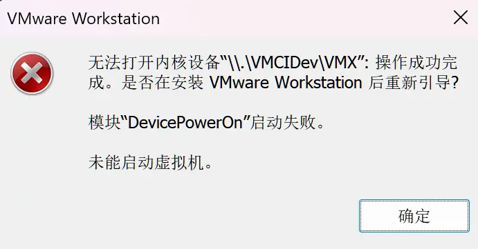

> 记录琐碎的技术问题以及解决方案。

<details>
<summary>目录</summary>

- [编码与乱码](#编码与乱码)
    - [UTF-8 编码的 `.ps1` 脚本依然使用 ANSI 输出字符串](#utf-8-编码的-ps1-脚本依然使用-ansi-输出字符串)
    - [Winlator 素晴日乱码](#winlator-素晴日乱码)
- [VMware](#vmware)
    - [无法打开内核设备“\\.\\VMCIDev\\VMX”](#无法打开内核设备vmcidevvmx)
- [机器学习](#机器学习)
    - [`CUDA error: device-side assert triggered` 之后高强度写磁盘](#cuda-error-device-side-assert-triggered-之后高强度写磁盘)
- [浏览器](#浏览器)
    - [`--remote-debugging-port=9222` 无效](#--remote-debugging-port9222-无效)
- [Windows 模拟器](#windows-模拟器)
    - [Winlator 运行白永 FD 有声音无画面](#winlator-运行白永-fd-有声音无画面)

</details>

## 编码与乱码

### UTF-8 编码的 `.ps1` 脚本依然使用 ANSI 输出字符串

#### 环境

- 2026.4.30
- 系统环境为简体中文 Windows 11，未开启“Beta 版: 使用 Unicode UTF-8 提供全球语言支持”。
- 运行脚本的 PowerShell 版本为 `5.1.26100.6584`。

#### 问题描述

以下 `.ps1` 脚本使用 UTF-8 编码。

```powershell
git commit -m "消息"
```

运行后，在 VS Code 与 GitHub 的 Git 提交记录中均显示为 `娑堟伅`。

使用 Python 转换编码。

```python
'娑堟伅'.encode('gbk').decode('utf-8')
```

结果为 `消息`，因此可以确认在某一环节必然使用 GBK 解码过。

#### 解决方案

- 方案一：使用 PowerShell 7 运行脚本。
- 方案二：将 `.ps1` 脚本的存储编码改为 UTF-8 with BOM。

#### 问题原因

VS Code 与 GitHub 不可能都是 GBK 环境，因此可以确认 Git 存储的 commit message 就是 UTF-8 编码的 `娑堟伅`，问题出在信息进入 `git.exe` 之前。

原脚本使用 UTF-8 存储，因此磁盘上 `消息` 对应的原始字节为 `E6 B6 88 E6 81 AF`。

由于文件没有 BOM，PowerShell 5 默认使用 ANSI（在简体中文系统中为 GBK）解码读取，即 `娑堟伅`，再用 UTF-16 LE 编码为 `FF FE 11 5A 1F 58 05 4F` 并存储在内存里的 `String` 对象中。

执行 `git` 命令时，PowerShell 5 将 UTF-16 LE 编码的 `娑堟伅` 转换成 UTF-8 编码，字节序列变为 `E5 A8 91 E5 A0 9F E4 BC 85`，再传递给 `git.exe`，这就是 `git.exe` 存储在磁盘的字节序列，即 UTF-8 编码的 `娑堟伅`。

VS Code 和 GitHub 使用 UTF-8 读取，于是解码成 `娑堟伅` 并显示，此为乱码来源。

BOM 是代表编码的文件头，将脚本编码换成 UTF-8 with BOM 之后，PowerShell 5 通过 BOM 确认文件编码为 UTF-8，才会使用 UTF-8 读取，之后传递给 `git.exe` 也是用 UTF-8 传递，因此没有乱码。

而 PowerShell 7 默认用 UTF-8 读取，因此没有乱码。

### Winlator 素晴日乱码

#### 环境

- 2026.6.27
- Winlator 11.1
- 一加 13
- Android 15
- ColorOS 15
- フルボイスHD版
- 冥月·凌雪汉化组

#### 问题描述

在 Winlator 中，双击资源内提供的 `font.ttf` 没有反应，于是将 `font.ttf` 复制到容器内的 `C:\Windows\Fonts`，游戏内依然乱码。

#### 解决方案

在容器设置中添加环境变量
- `LC_ALL` = `zh_CN.UTF-8`

#### 问题原因

可能是由于在 Winlator 默认的英文环境下，游戏程序发出的 `素晴字体`（`font.ttf` 的标题）请求被系统错误地识别为一串西欧乱码，于是无法匹配到 `font.ttf`。

## VMware

### 无法打开内核设备“\\.\VMCIDev\VMX”

#### 环境

- 2026.4.18
- Windows 11

#### 问题描述



#### 解决方案

- 打开虚拟机配置文件，Windows 默认位于 `~/Documents/Virtual Machines/{name}/{name}.vmx`，也可以在 `虚拟机` → `设置` → `选项` → `高级` 的最后一项找到。
- 将 `vmci0.present` 的值从 `"TRUE"` 修改为 `"FALSE"`。
- 重新启动虚拟机。

#### 问题原因

未知。

## 机器学习

### `CUDA error: device-side assert triggered` 之后高强度写磁盘

#### 环境

- 2026.6.19
- Windows 11
- CUDA Version: 12.8

#### 问题描述

`CUDA error: device-side assert triggered` 之后磁盘占用保持在 98% 以上，磁盘剩余空间迅速减少 10 GB 以上。

#### 解决方案

该文件位于 `C:\Windows\LiveKernelReports\`，删除即可。

#### 问题原因

当 CUDA 程序发生 `device-side assert triggered` 时，GPU 核心通常会终止当前执行管道并挂起。Windows 的显卡硬件看门狗（Watchdog）检测到显卡驱动长时间无响应（即 TDR 机制），为了防止系统直接蓝屏，Windows 会在后台重启显卡驱动，并将当时的内核与显存状态强制转储到 `C:\Windows\LiveKernelReports` 目录下，生成这个实时内核转储文件。

## 浏览器

### `--remote-debugging-port=9222` 无效

#### 环境

- 2026.7.19
- Windows 11
- Google Chrome 150.0.7871.128

#### 问题描述

`start chrome --remote-debugging-port=9222` 后，`9222` 端口实际未被监听。

#### 解决方案

指定独立配置目录：

```powershell
Start-Process chrome -ArgumentList "--remote-debugging-port=9222", "--user-data-dir=C:\chrome_dev_profile"
```

#### 问题原因

未知。

## Windows 模拟器

### Winlator 运行白永 FD 有声音无画面

#### 环境

- 2026.7.20
- Winlator 11.1
- 一加 13
- Android 15
- ColorOS 15
- [FAVORITE] アストラエアの白き永遠 Finale -白き星の夢-  星辰恋曲的白色永恒-Finale- V2.0最终汉化硬盘版[Xmoe汉化组]

#### 问题描述

如题。

#### 解决方案

修改容器参数如下（加粗为非默认）：
- Graphic Driver
    - Vulkan: Turnip
        - Version: 26.1.0
    - OpenGL: Gladio
- DX Wrapper
    - Direct3D: **WineD3D**
        - Version: 10.10
        - DDraw Wrapper: WineD3D
        - Renderer: **Vulkan**
    - DirectX 12: VKD3D
        - Version: 2.14.1
        - D3D Feature Level: 12.2
- Audio Driver: ALSA
- HUD Mode: Disabled

另外，虽然修改参数后能显示画面，但调整为全屏模式还是会崩溃，此时将容器尺寸设为 1020 × 650 即可使游戏画面正好填满整个屏幕。

#### 问题原因

未知。
